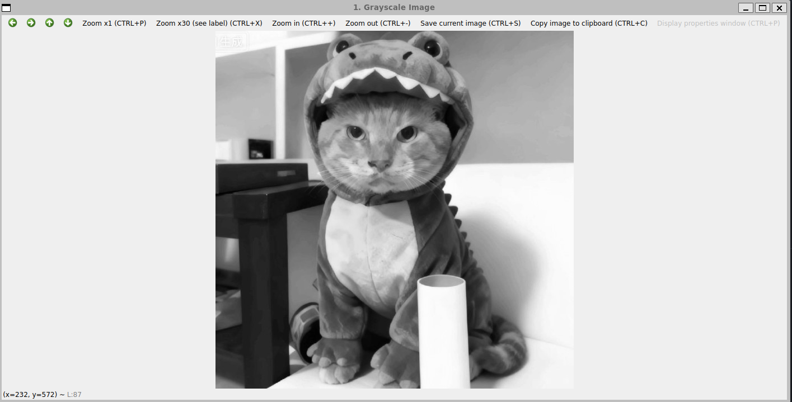
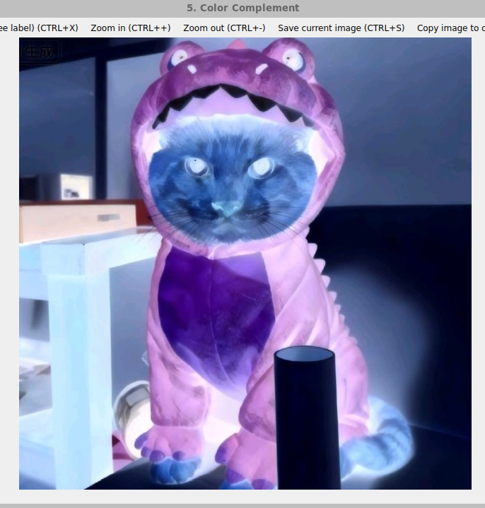

#   **高级图像处理与分析课程实验报告**

 **学号：SA25225261 姓名：吕智 日期：2025.11.6**


# **实验1：图像灰度变换**

### **一、实验内容**

1. 利用OpenCV读取图像 

​	具体内容：用打开OpenCV打开图像，并在窗口中显示 

2. 灰度图像二值化处理 

​	具体内容：设置并调整阈值对图像进行二值化处理。

3. 灰度图像的对数变换 

​	具体内容：设置并调整r值对图像进行对数变换。

4. 灰度图像的伽马变换 

​	具体内容：设置并调整γ值对图像进行伽马变换。

5. 彩色图像的补色变换 

​	具体内容：对彩色图像进行补色变换。

### **二、实验完成情况**

##### 1. 利用OpenCV读取图像

​	使用`opencv`库的`imread()`函数来读取图像文件路径，成功时返回`Mat`矩阵，失败则返回空对象。使用`opencv`库的`imshow()`函数来展示图像，`waitkey(0)`来等待用户按键来结束展示图像，`destoryAllWindows()`来关闭图像。

​	其中，把`imshow()`，`waitkey(0)`，`destoryAllWindows()`封装为一个函数`showAndWait()`来实现图像的按顺序展示。

```cpp
// 显示图像函数的封装
void showAndWait(const string& windowName, const Mat& image){
    if (!image.empty()) {
        imshow(windowName, image);
        waitKey(0);
        destroyAllWindows();
    }
}
int main() {
    // 1. 读取图像
    Mat color_image = imread(IMAGE_PATH);
    if (color_image.empty()) {
        cerr << "错误: 无法读取图像. 请检查路径是否正确: " << IMAGE_PATH << endl;
        return -1;
    }
    // 显示原始彩色图像
    showAndWait("0. Original Color Image", color_image);
    return 0;
}
```

##### 2.灰度图像二值化处理

​	在进行灰度图像的二值化处理前，我们需要先从彩色图像中得到灰度图像，由于彩色图像是三通道的，而灰度图像是单通道的，所以需要经过公式来把三通道转变为单通道，其公式为：`Gray = 0.299*R + 0.587*G + 0.114*B` ,人眼对绿色最为敏感，而对蓝色最不敏感。下面是实现转变的函数：

```cpp
// 彩色图像变为灰度图像 Gray = 0.299*R + 0.587*G + 0.114*B
void colorToGray(const Mat& image,Mat& gray_image){
    CV_Assert(image.type() == CV_8UC3); //检查图像的类型是否为 CV_8UC3
    gray_image.create(image.size(), CV_8UC1); //创建单通道的灰度图像
    for (int i = 0; i < image.rows; ++i) {
        const Vec3b* p_src = image.ptr<Vec3b>(i); //彩色图像的三通道指针
        uchar* p_dst = gray_image.ptr<uchar>(i); //灰度图像的单通道指针
        for (int j = 0; j < image.cols; ++j) {
            uchar B = p_src[j][0]; //0 代表 Blue
            uchar G = p_src[j][1]; //1 代表 Green
            uchar R = p_src[j][2]; //2 代表 Red
            p_dst[j] = saturate_cast<uchar>(0.299 * R + 0.587 * G + 0.114 * B); // 计算灰度值
        }
    }
}
```

​	灰度图像二值化处理方法为：遍历每个像素，判断其灰度值。当灰度值大于某一阈值时，置灰度值为255，小于等于阈值时置0。具体函数为：

```cpp
// 灰度图像二值化处理
void binaryThresold(const Mat& gray_image,Mat& binary_image,int threshold){
    binary_image.create(gray_image.size(), gray_image.type()); //创建二值化图像
    for (int i = 0; i < gray_image.rows; ++i) {
        const uchar* p_src = gray_image.ptr<uchar>(i);
        uchar* p_dst = binary_image.ptr<uchar>(i);  
        for (int j = 0; j < gray_image.cols; ++j) {
            uchar pixel = p_src[j];
            // 判断像素与阈值的大小关系，更大即为255，更小即为0
            if (pixel > threshold)
                p_dst[j] = 255;
            else
                p_dst[j] = 0;
        }
    }
}
```

##### 3.灰度图像的对数变换

  	对数变换的公式为$s=c*log(1+r)$,这个变换将输入中范围较窄的低灰度值映射为输出中范围较宽的灰度级，将输入中的高灰度值映射为输出中范围较窄的灰度级，其中$c$为系数，$r$为像素的灰度值。具体函数如下：

```cpp
//灰度图像的对数变换
void logTransform(const Mat& gray_image, Mat& log_image,float c){
    Mat src_float;
    gray_image.convertTo(src_float, CV_32FC1); // 由于进行对数变换，故转换为 float 类型

    log_image.create(src_float.size(), src_float.type()); //创建图像
    for (int i = 0; i < src_float.rows; ++i) {
        const float* p_src = src_float.ptr<float>(i);
        float* p_dst = log_image.ptr<float>(i);

        for (int j = 0; j < src_float.cols; ++j) {
            float r = p_src[j];
            p_dst[j] = c * log(1 + r); // 对数变换公式，s = c * log(1 + r)，r是像素
        }
    }
    log_image.convertTo(log_image, CV_8UC1); //确保最终在0-255范围
}
```

##### 4.灰度图像的伽马变换

​	伽马变换的公式为 $s = cr^γ$，主要用于图像的校正，对漂白的图片或者过黑的图片进行修正，也就是对灰度级过高或者灰度级过低的图片进行修正，增强对比度，其中$c$和$γ$为正常数，$r$为像素。具体函数如下：

```cpp
//灰度图像的伽马变换
void gammaTransform(const Mat& gray_image, Mat& gamma_image,float gamma){
    Mat src_float;
    gray_image.convertTo(src_float, CV_32FC1, 1.0 / 255.0); // 归一化到 [0, 1]
    gamma_image.create(src_float.size(), src_float.type()); //创建图像
    for (int i = 0; i < src_float.rows; ++i) {
        const float* p_src = src_float.ptr<float>(i);
        float* p_dst = gamma_image.ptr<float>(i);
        for (int j = 0; j < src_float.cols; ++j) {
            float r = p_src[j];
            p_dst[j] = pow(r, gamma); // s = c * r^gamma, c=1
        }
    }
    gamma_image.convertTo(gamma_image, CV_8UC1, 255.0); //转换回 8-bit unsigned char，并乘以 255 恢复范围
}
```

##### 5. 彩色图像的补色变换

补色变换可用于增强彩色图像中各个暗色区 域中的细节，尤其是在这些区域的尺寸较大时。补色变换的公式为:$255-像素$。具体函数如下：

```cpp
//彩色图像的补色变换
void colorComplement(const Mat& image, Mat& complement_image){
    CV_Assert(image.type() == CV_8UC3); 
    complement_image.create(image.size(), image.type()); //创建补色图像
    for (int i = 0; i < image.rows; ++i) {
        const Vec3b* p_src = image.ptr<Vec3b>(i);
        Vec3b* p_dst = complement_image.ptr<Vec3b>(i);
        for (int j = 0; j < image.cols; ++j) {
            // 对 B, G, R 三个通道分别进行补色操作,公式为 255 - pixel 
            p_dst[j][0] = 255 - p_src[j][0]; // B
            p_dst[j][1] = 255 - p_src[j][1]; // G
            p_dst[j][2] = 255 - p_src[j][2]; // R
        }
    }
}
```

### **三、实验结果**

##### 1. 利用OpenCV读取图像


##### 2.灰度图像二值化处理

灰度图像:



下面是采用阈值为127的二值化后的二值化图像：

.png)

##### 3.灰度图像对数变换

下面三张图分别是c=20，c=45，c=60情况下的对数变换

.png)

.png)

.png)

从上图中可以发现，c=20时，图像整体偏暗，拉伸不足;c=standard时，图像较为均衡，拉伸适当，c=60时，严重曝光过度，几乎全白，为过度拉伸。

##### 4.灰度图像伽马变换

下面三张图分别是γ=0.4，γ=1.2，γ=2.5情况下的伽马变换

.png)

.png)

.png)

当γ<1时，拉伸暗部，压缩亮部，此时图像整体变亮，适合处理曝光不足的情况;γ>1时，压缩暗部，拉伸亮部，此时图像整体变暗。从γ=1.2和γ=2.5的对比可以看出，γ越大，图像就会变得越暗，适合处理曝光过度的情况。

##### 5. 彩色图像的补色变换




完整代码见`1.cpp`，代码使用的是`linux`环境下配置的`opencv`，采用`cmake`来管理构建流程。

