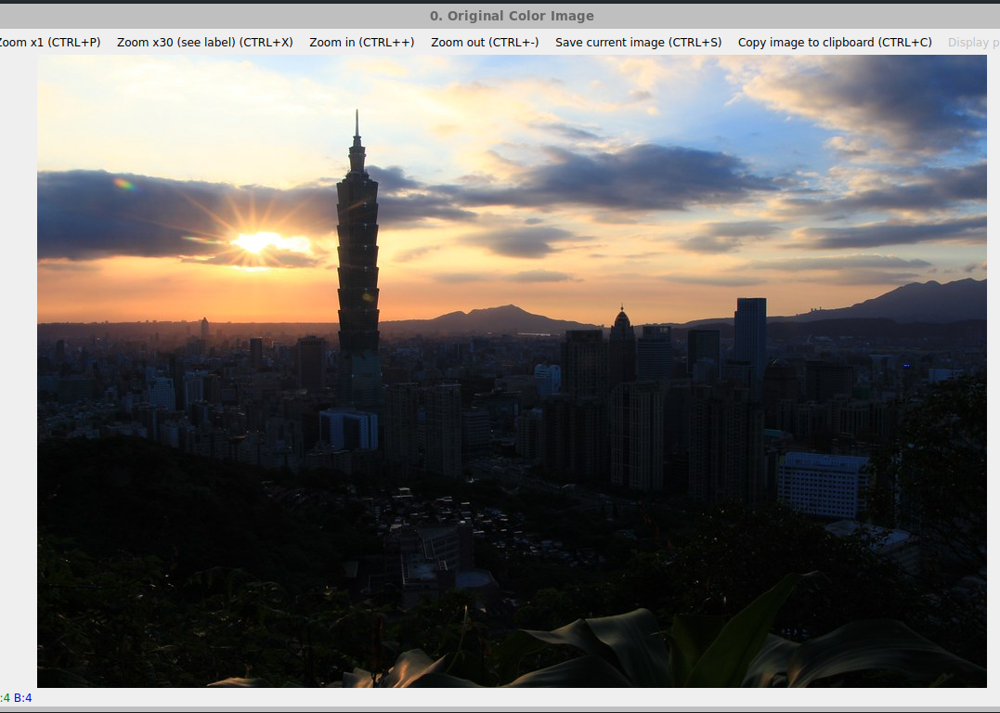
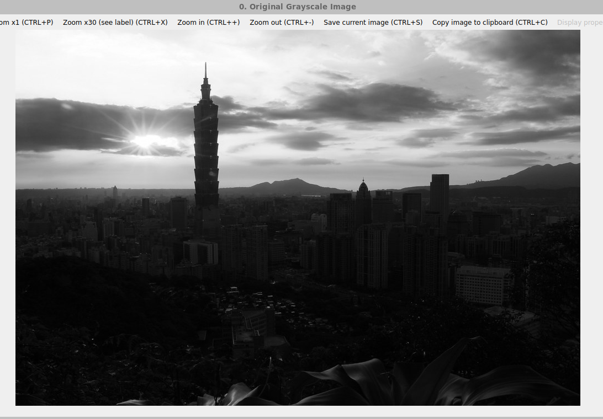
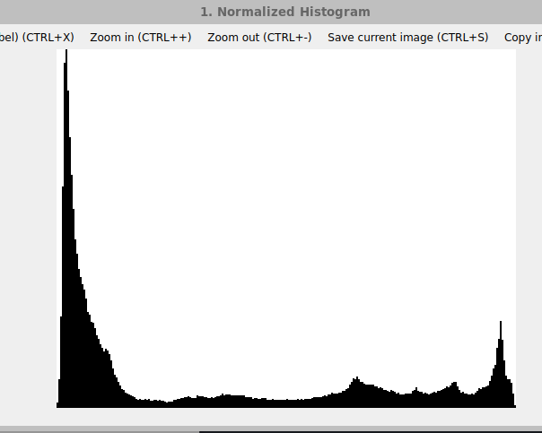
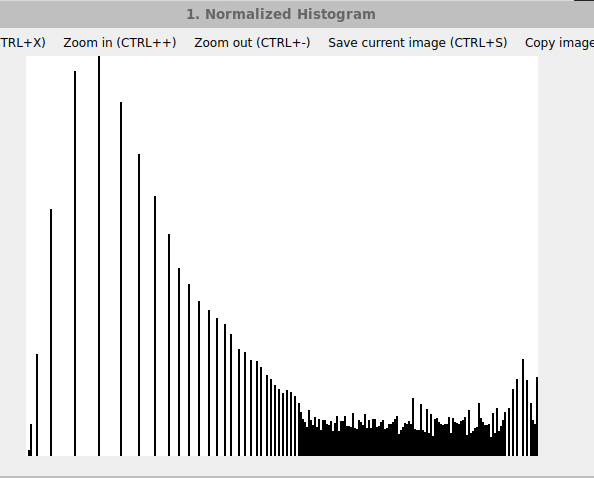
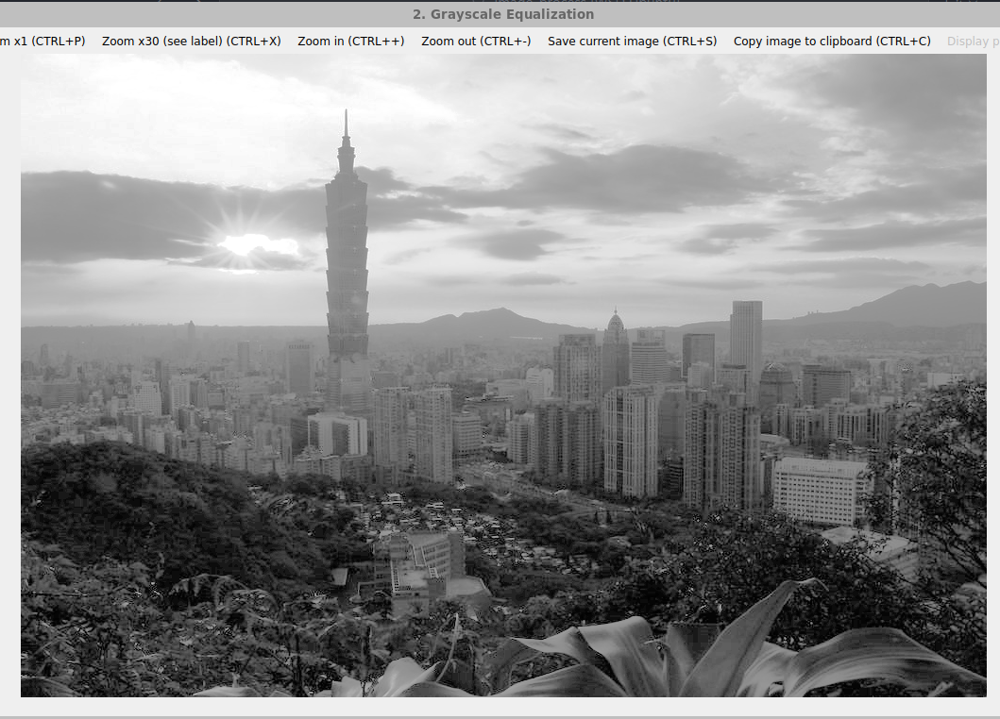
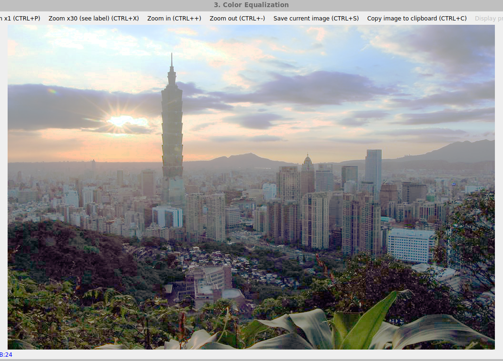

#   **高级图像处理与分析课程实验报告**

 **学号：SA25225261 姓名：吕智 日期：2025.11.6**


# **实验2：直方图均衡化**

### **一、实验内容**

1. 计算灰度图像的归一化直方图 

​	具体内容：利用OpenCV对图像像素进行操作，计算归一化直方图并在窗口中以图形的方式显示出来

2. 灰度图像直方图均衡处理

​	具体内容：通过计算归一化直方图,设计算法实现直方图均衡化处理。

3. 彩色图像直方图均衡处理 

​	具体内容：在灰度图像直方图均衡处理的基础上实现彩色直方图均衡处理。

### **二、实验完成情况**

##### 1. 计算灰度图像的归一化直方图

​	令$r_k,k=0,1,2,···，L-1$ 表示一幅$L$级灰度数字图像$f(x,y)$的灰度。$f$的非归一化直方图定义为：
$$
h(r_k) = n_k,k=0,1,2,···，L-1
$$
其中，$n_k$为$f$中灰度为$r_k$的像素的数量，并细分的灰度称为直方图容器。类似的，$f$的归一化直方图定义为：
$$
p(r_k)=\frac{h(r_k)}{MN}=\frac{n_k}{MN}
$$
式中，$M$和$N$分别是图像的行数和列数。多数情况下处理的都是归一化直方图。本实验中，我们首先统计出256个灰度级在整个图像中分别出现了多少次，然后计算像素的总数，通过灰度出现的频数比上像素总数，就可以从中得到归一化直方图，下面是具体函数：

```cpp
//计算灰度图像的归一化直方图
void calculateNormalizedHist(const Mat& gray_image){
    const int bins = 256; //灰度等级个数
    // 1. 初始化并统计灰度数目 h(i)
    vector<float> hist(bins,0);
    long total_pixels = gray_image.total();
    for (int i = 0; i < gray_image.rows; ++i) {
        const uchar* p = gray_image.ptr<uchar>(i);
        for (int j = 0; j < gray_image.cols; ++j) {
            hist[p[j]]++; //统计每个灰度的数目
        }
    }
    // 2. 计算归一化直方图
    vector<float> normalized_hist(bins);
    for (int i = 0; i < bins; ++i) {
        normalized_hist[i] = (float)hist[i] / total_pixels; // 每个灰度的像素数目/总像素数目
    }
    // 3. 绘制直方图
    int hist_w = 512;
    int hist_h = 400;
    int bin_w = cvRound((double)hist_w / bins); // 每个柱子的宽度
    Mat hist_image(hist_h, hist_w, CV_8UC1, Scalar(255)); // 白色背景
    float max_val = *max_element(normalized_hist.begin(), normalized_hist.end()); //// 找到直方图的最大值，用于归一化绘图高度
    for (int i = 0; i < bins; ++i) {
        // 计算当前柱子的高度 (归一化到图像高度)
        int bar_h = cvRound(normalized_hist[i] * hist_h / max_val);
        // 绘制矩形柱子
        rectangle(hist_image,       
            Point(bin_w * i, hist_h - bar_h),// 左上角点 (x, y)
            Point(bin_w * (i + 1) - 1, hist_h), // 右下角点 (x, y)
            Scalar(0), // 黑色
            FILLED); // 填充矩形
    }
    showAndWait("1. Normalized Histogram", hist_image);
}
```

这里采用了rectangle函数来绘制每个灰度柱子，最终生成了一张灰度二值图。

##### 2. 灰度图像直方图均衡处理

​	直方图均衡化的离散形式为：
$$
s_k = T(r_k) = (L-1)\sum^{k}_{j=0}p_r(r_j),k=0,1,2,···，L-1
$$
其中，$p_r(r_k)$为归一化图像直方图，$\sum^{k}_{j=0}p_r(r_j)$为累积分布函数$CDF$，使用上式即可得到均衡化的直方图。具体代码流程为：1.*统计直方图*，2.*计算累积分布函数 CDF*，3.*计算变化后的灰度级* 4. *输出图像* ，代码如下：

```cpp
// 灰度图像直方图均衡化处理
void equalizeHistGray(const Mat& gray_image, Mat& equalize_gray){
    const int bins = 256; //灰度等级个数
    // 1. 统计直方图 h(i)
    vector<int> hist(bins, 0);
    for (int i = 0; i < gray_image.rows; ++i) {
        const uchar* p = gray_image.ptr<uchar>(i);
        for (int j = 0; j < gray_image.cols; ++j) {
            hist[p[j]]++;
        }
    }
    long total_pixels = gray_image.total();

    // 2. 计算累积分布函数 CDF
    vector<float> cdf(bins, 0.0);
    float cumulative_sum = 0.0;
    for (int i = 0; i < bins; ++i) {
        cumulative_sum += (float)hist[i] / total_pixels;
        cdf[i] = cumulative_sum;
    }

    // 3. 计算灰度级
    vector<int> s(bins, 0);
    for (int i = 0; i < bins; ++i)
        s[i] = saturate_cast<uchar>(bins * cdf[i] + 0.5);
    
    // 4. 输出图像
    equalize_gray.create(gray_image.size(), gray_image.type()); // 初始化输出图像
     for (int i = 0; i < gray_image.rows; ++i) {
        const uchar* p_src = gray_image.ptr<uchar>(i);       // 输入行指针
        uchar* p_dst = equalize_gray.ptr<uchar>(i);         // 输出行指针
        for (int j = 0; j < gray_image.cols; ++j) {
            p_dst[j] = s[p_src[j]]; // 将原始灰度值映射到均衡化后的灰度值
        }
    }      
}
```

##### 3. 彩度图像直方图均衡处理

​	彩色图像是三通道的，它有RGB，CMYK, HSI三种模型，所以对它进行直方图均衡处理的方法也是许多的。对于RGB模型，可以分别对三个通道进行灰度图像的直方图均衡化处理，再将三通道合并;对于HSI模型，由于I即为灰度，所以可以直接对I通道进行直方图均衡化，再将图像拼起来即可。本实验代码采用了分别对RGB三通道进行灰度图像直方图均衡化的处理。

```cpp
// 彩色图像直方图均衡处理
void equalizeHistColor(const Mat& color_image, Mat& equalize_color){
    CV_Assert(color_image.type() == CV_8UC3);
    // 1. 分离 B, G, R 通道
    vector<Mat> bgr_channels;
    split(color_image, bgr_channels);

    // 2. 对每个通道独立进行直方图均衡化
    Mat b_equalized, g_equalized, r_equalized;
    equalizeHistGray(bgr_channels[0], b_equalized); // Blue
    equalizeHistGray(bgr_channels[1], g_equalized); // Green
    equalizeHistGray(bgr_channels[2], r_equalized); // Red

    // 3. 将均衡化后的三个通道合并
    vector<Mat> equalized_channels = {b_equalized, g_equalized, r_equalized};
    merge(equalized_channels, equalize_color);
}

```

### **三、实验结果**

##### 1. 计算灰度图像的归一化直方图

原图：



原图转变为灰度图像：



对灰度图像进行归一化处理：



##### 2. 灰度图像直方图均衡处理

直方图均衡化：



均衡化后的图片：



从上面两张图可以看到：归一化直方图，灰度集中在低区间，图像偏暗、对比度低，而均衡化后的直方图，灰度分布明显更均匀，原本集中的低灰度被 “拉伸” 到了更宽的范围，更加明亮

##### 3. 彩度图像直方图均衡处理

对彩色图像均衡化后的图片：



从原图和均衡化后的图片进行对比可得：原图画面存在明显的明暗分层，下方植被根本看不清；而均衡化后的图片变得更清晰，下方原本黑暗的植物变得明亮清晰，有效提升彩色图像的细节，让暗部的隐藏信息显现


