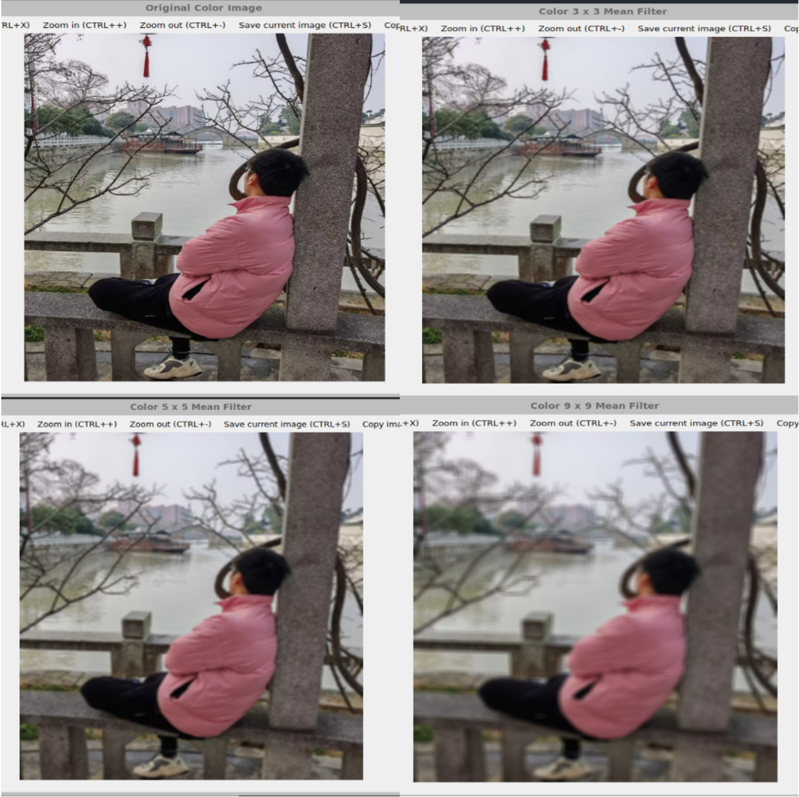
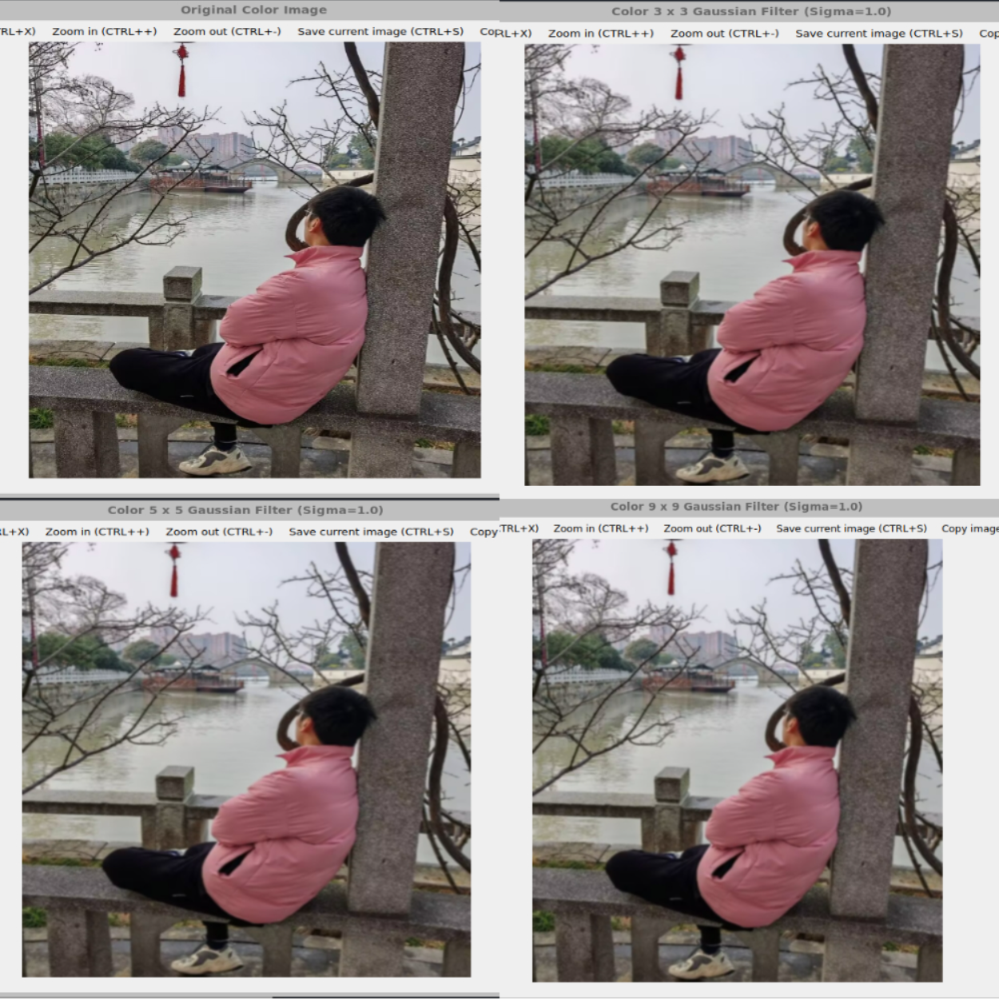
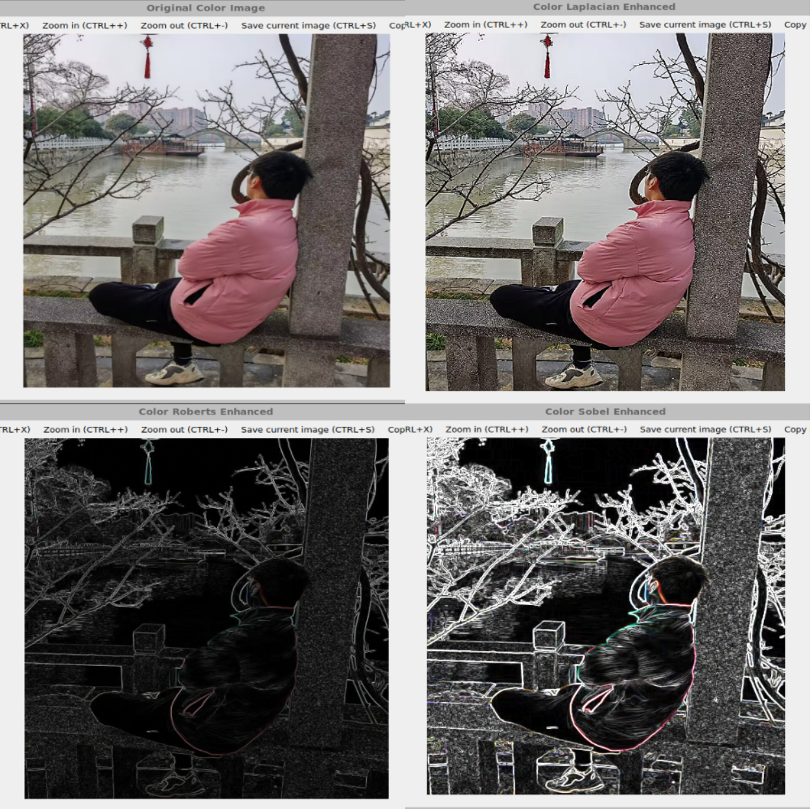

#   **高级图像处理与分析课程实验报告**

 **学号：SA25225261 姓名：吕智 日期：2025.11.9**


# **实验1：图像灰度变换**

### **一、实验内容**

1. 利用均值模板平滑灰度图像 

​	具体内容：利用$OpenCV$对图像像素进行操作，分别利用$3*3$、$5*5$和$9*9 $尺寸的均值模板平滑灰度图像 

2. 利用高斯模板平滑灰度图像 

​	具体内容：利用$OpenCV$对图像像素进行操作，分别利用$3*3$、$5*5$和$9*9 $​尺寸的高斯模板平滑灰度图像灰度图像

3. 利用$Laplacian、Robert、Sobel$ 模板锐化灰度图像。

   具体内容：利用$OpenCV$对图像像素进行操作，，分别利用$Laplacian、Robert、 Sobel$ 模板锐化灰度图像

4. 利用高提升滤波算法增强灰度图像 

​	具体内容：利用$OpenCV$ 对图像像素进行操作，设计高提升滤波算法增 强图像

5. 利用均值模板平滑彩色图像 

​	具体内容：利用$OpenCV$分别对图像像素的$RGB$三个通道进行操作，利用$3*3、5*5$和$9*9$​尺寸的均值模板平滑彩色图像 

6. 利用高斯模板平滑彩色图像 

​	具体内容：利用$OpenCV$分别对图像像素的$RGB$三个通道进行操作，分别利用$3*3$、$5*5$和$9*9 $尺寸的高斯模板平滑彩色图像

7. 利用$Laplacian、Robert、Sobel$​ 模板锐化灰度图像

   具体内容：利用$OpenCV$分别对图像像素的$RGB$三个通道进行操作，分别利用$Laplacian、Robert、 Sobel$ 模板锐化彩色图像

### **二、实验完成情况**

##### 1. 利用均值模板平滑灰度图像

线性空间滤波器在图像$f$和滤波器核$w$之间执行乘积之和运算，我们在图像中移动核，使其中心和各个像素重合，然后将核的系数与对应像素相乘再相加赋于原像素。一般来说，大小为$m \times n$的核对大小为$M \times N$的图像的线性空间滤波可以表示为
$$
g(x,y) = \sum_{s=-a}^a\sum_{t=-b}^bw(s,t)f(x+s, y+t) 
$$
式中，$x$和$y$发生变化，使得核的中心能够访问$f$中的每个像素。$(x,y)$的值不变时，该式实现乘积之和。这是实现线性滤波的核心工具，在$opencv$中，可以采用`filter2D()`函数来完成这种卷积操作,它的参数分别为输入图像`src`,输出图像`dst`,输出图像的深度`depth`,卷积核`kernel`.

均值模板为$k×k$大小，其中每个元素的值均为$\frac{1}{k×k}$,实现代码如下：

```cpp
//均值模板
void meanFilter(const Mat& image,int k,bool is_color){
    // 手动创建均值模板
    Mat kernel = Mat::ones(k, k, CV_32F) / (float)(k * k); //创建一个均值模板,模板大小根据k改变，每个位置为1/k*k
    string name = format("%d x %d Mean Filter", k, k);
    if(!is_color){
        grayFilter(image,kernel,"Gray " + name,true);
    }else{
        colorFilter(image,kernel,"Color " + name,true);
    }
}
```

其中`grayFilter()`用来处理灰度图像，`colorFilter()`用来处理彩色图像，可以复用这两个函数来应用于不同的模板。这两个函数的代码如下：

```cpp
//灰度图像的模板过滤
Mat grayFilter(const Mat& gray_image,const Mat& kernel,const string& windowname,bool is_mean){
    Mat filtered_gray;
    if(is_mean){
        filter2D(gray_image,filtered_gray,gray_image.depth(),kernel); 
        showAndWait(windowname,filtered_gray);
    }
    else
        filter2D(gray_image,filtered_gray,CV_16S,kernel);
    return filtered_gray;
}
```

```cpp
//彩色图片的模板过滤：分通道进行
Mat colorFilter(const Mat& color_image,const Mat& kernel,const string& windowname,bool is_mean){
    CV_Assert(color_image.type() == CV_8UC3); //检查图像的类型是否为 CV_8UC3
    Mat filtered_color;
    vector<Mat> bgr_channels;
    split(color_image, bgr_channels); //分离通道
    // 对每个通道应用滤波
    for (int i = 0; i < 3; ++i) {
        Mat filter_channel;
        if (!is_mean) {
            filter2D(bgr_channels[i], filter_channel, CV_16S, kernel);  //锐化模板时，深度选择为CV_16S
            filter_channel.copyTo(bgr_channels[i]);
        } else {
            // 平滑滤波,保持原深度
            filter2D(bgr_channels[i], bgr_channels[i], -1, kernel); // -1 保持原深度 (CV_8U)
        }
    }
    merge(bgr_channels,filtered_color); //合并通道
    if (is_mean) 
        showAndWait(windowname,filtered_color); // 平滑图像直接显示 CV_8UC3
    return filtered_color;
}
```

##### 2. 利用高斯模板平滑灰度图像

高斯核由如下的公式计算
$$
w(s,t) = G(s,t) = Ke^{-\frac{s^2+t^2}{2 {\sigma}^2}} 
$$
在具体操作中高斯核是对上式取样得到的，规定$s$和$t$的值，然后计算函数在这些坐标处的值，这些值是核的系数。通过将核的系数除以各系数之和实现核的归一化。$\sigma$控制高斯函数关于其均值的”展开度“，其值越大，对图像的平滑效果越明显。一个大小为$3\times3$的高斯模板如下
$$
\frac{1}{4.8976}
\begin{bmatrix}
0.3679 & 0.6065 & 0.3679 \\
0.6065 & 1.0000 & 0.6065 \\
0.3679 & 0.6065 & 0.3679 \\
\end{bmatrix}
$$
我们首先编写用于计算大小为$k×k$，标准差为$ \sigma $的高斯核的函数如下

```cpp
Mat createGaussianKernel(int k,double sigma){
    // 手动创建高斯模板
    Mat kernel = Mat::ones(k, k, CV_32F); 
    double sum = 0.0;
    int center = k / 2;
    double sigma2 = 2.0 * sigma * sigma;
    for (int i = 0; i < k; ++i) {
        for (int j = 0; j < k; ++j) {
            int x = i - center;
            int y = j - center;
            double value = exp(-(x * x + y * y) / sigma2); // 2D 高斯函数 exp(-(x^2 + y^2) / (2 * sigma^2))
            kernel.at<float>(i, j) = (float)value;
            sum += value;
        }
    }    
    for (int i = 0; i < k; ++i) 
        for (int j = 0; j < k; ++j) 
            kernel.at<float>(i,j) = kernel.at<float>(i,j)/sum; //归一化处理
    return kernel;
}
```

高斯模板平滑函数为：

```cpp
//高斯平滑模板
void gaussFilter(const Mat& image,int k,double sigma,bool is_color){
    Mat kernel = createGaussianKernel(k,sigma);
    string name = format("%d x %d Gaussian Filter (Sigma=%.1f)", k, k, sigma);
    if(!is_color){ //处理灰度图像
        grayFilter(image,kernel,"Gray " + name,true);
    }else{
        colorFilter(image,kernel,"Color " + name,true); //处理彩色图像
    }
}
```

##### 3.利用$Laplacian、Robert、Sobel$ 模板锐化灰度图像

最简单的各向同性导数算子是拉普拉斯，对于两个变量的函数$f(x,y)$，它定义为
$$
{\nabla}^2f = \frac{{\partial}^2f}{{\partial}x^2} + \frac{{\partial}^2f}{{\partial}y^2} \tag{3.7}
$$
再将对角方向整合到数字拉普拉斯核的定义中，我们可以构造出下面四个拉普拉斯核
$$
\begin{bmatrix}
0 & 1 & 0 \\
1 &-4 & 1 \\
0 & 1 & 0 \\
\end{bmatrix}
\begin{bmatrix}
1 & 1 & 1 \\
1 &-8 & 1 \\
1 & 1 & 1 \\
\end{bmatrix}
\begin{bmatrix}
 0 &-1 & 0 \\
-1 & 4 &-1 \\
 0 &-1 & 0 \\
\end{bmatrix}
\begin{bmatrix}
-1 &-1 &-1 \\
-1 & 8 &-1 \\
-1 &-1 &-1  \\
\end{bmatrix} \tag{3.8}
$$
拉普拉斯是导数算子，因此会突出图像中的急剧过渡，并且不强调缓慢变化的灰度区域。这往往会产生具有灰色边缘和其他不连续性的图像，它们都叠加在暗色无特征背景上。将拉普拉斯图像与原图像相加，就可以恢复背景特征，同时保留拉普拉斯的锐化效果。因此我们使用拉普拉斯锐化图像的基本方法是
$$
g(x,y) = f(x,y) + c[\nabla^2f(x,y)] \tag{3.9}
$$
$f(x,y)$和$g(x,y)$分别是输入图像和锐化后的图像。若使用$(3.8)$中的前两个核，$c=-1$；若使用$(3.8)$中的后两个核，$c=1$​。使用Laplacian算子锐化图像的算法如下，这里采用的是第一个拉普拉斯核

```cpp
// 拉普拉斯锐化模板
void laplacianFilter(const Mat& image, const string& windowName) {
    Mat laplacian_kernel = (Mat_<float>(3, 3) << 0, 1, 0, 1, -4, 1, 0, 1, 0); //拉普拉斯核
    Mat src_float;
    image.convertTo(src_float, CV_32F); // 转换为浮点型进行卷积和计算

    Mat laplacian_result;
    filter2D(src_float, laplacian_result, CV_32F, laplacian_kernel);

    Mat sharp_float;
    sharp_float.create(src_float.size(), src_float.type());
    int channels = src_float.channels();
    int cols_step = src_float.cols * channels;
    for (int i = 0; i < src_float.rows; ++i) {
        // 获取每一行的浮点数指针
        const float* p_src = src_float.ptr<float>(i);
        const float* p_lapl = laplacian_result.ptr<float>(i);//拉普拉斯锐化
        float* p_sharp = sharp_float.ptr<float>(i); //最终图像
        for (int j = 0; j < cols_step; ++j) {
            p_sharp[j] = p_src[j] + p_lapl[j];  // f_sharp = f_orig + f_lap
        }
    }
    Mat sharp_final;
    sharp_float.convertTo(sharp_final, CV_8U); // 转换为 CV_8U格式
    showAndWait(windowName, sharp_final);
}
```

在图像处理中，一阶导数是用梯度幅度实现的。图像$f$在坐标$(x,y)$处的梯度定义为二维列向量
$$
\nabla f \equiv grad(f) = 
\begin{bmatrix}
g_x \\
g_y \\
\end{bmatrix}
=
\begin{bmatrix}
\frac{\partial f}{\partial x} \\
\frac{\partial f}{\partial y} \\
\end{bmatrix} 
$$
向量$\nabla f$的幅度表示为$M(x,y)$，其中
$$
M(x,y) = mag(\nabla f) = \sqrt{g_x^2 + g_y^2} 
$$
是梯度向量方向的变化率在$(x,y)$处的值。$M(x,y)$是与原图像大小相同的图像，它是$x$和$y$在$f$的所有像素位置上变化时创建的。实践中称这幅图像为梯度图像。根据上面几个公式的离散近似构造的$Robert$交叉梯度算子如下
$$
RobertX = \begin{bmatrix}
-1 & 0 \\
 0 & 1
\end{bmatrix}
RobertY=\begin{bmatrix}
0 &-1 \\
1 & 0
\end{bmatrix}
$$
构造的$Sobel$算子如下
$$
SobelX=\begin{bmatrix}
-1 &-2 &-1\\
 0 & 0 & 0\\
 1 & 2 & 1\\
\end{bmatrix}
SobelY=\begin{bmatrix}
-1 & 0 & 1\\
-2 & 0 & 2\\
-1 & 0 & 1\\
\end{bmatrix}
$$
具体代码如下：

```cpp
//锐化模板，处理Robert和Sobel模板
Mat edgeEnhanceFilter(const Mat& image, const string& kernelType, bool is_color){
    Mat kernel;
    if(kernelType == "RobertsX")
        kernel = (Mat_<float>(2, 2) << 1, 0, 0, -1); //RobertsX算子
    else if (kernelType == "RobertsY")
        kernel = (Mat_<float>(2, 2) << 0, 1, -1, 0); //RobertsY算子
    else if (kernelType == "SobelX")
        kernel = (Mat_<float>(3, 3) << -1, 0, 1, -2, 0, 2, -1, 0, 1); //SobelX算子
    else if (kernelType == "SobelY")
        kernel = (Mat_<float>(3, 3) << -1, -2, -1, 0, 0, 0, 1, 2, 1); //SobelY算子   
    else
        return Mat();
    string name = kernelType + " Enhance/Edge";
    if(!is_color){ //处理灰度图像
        return grayFilter(image,kernel,"Gray " + name,false);
    }else{
        return colorFilter(image,kernel,"Color " + name,false); //处理彩色图像
    }
}
// 计算计算 Sobel或Roberts梯度的幅度
void calculateEdgeMagnitude(const Mat& gradX, const Mat& gradY, const string& windowName) {
    CV_Assert(gradX.depth() == gradY.depth());
    Mat gradX_float, gradY_float;
    // 强制转换为 32位浮点数，满足 magnitude 的要求
    gradX.convertTo(gradX_float, CV_32F); 
    gradY.convertTo(gradY_float, CV_32F);
    Mat magnitude_result_float;
    magnitude(gradX_float, gradY_float, magnitude_result_float); //计算 G = sqrt(Gx^2 + Gy^2)
    Mat final_display;
    convertScaleAbs(magnitude_result_float, final_display);// 转换为8U
    showAndWait(windowName, final_display);
}
```

##### 4.利用高提升滤波算法增强灰度图像

从图像中减去一幅平滑后的图像称为钝化掩蔽，它由如下步骤组成：

> 1. 模糊原图像。
> 2. 从原图像减去模糊后的图像（产生的差称为模板）。
> 3. 将模板与原图像相加。

令$\bar{f}(x,y)$表示模糊后的图像，公式形式的模板为
$$
g_{mask}(x,y) = f(x,y) - \bar{f}(x,y) \tag{3.5}
$$
 将加权后的模板与原图像相加：
$$
g(x,y) = f(x,y) + kg_{mask}(x,y) \tag{3.6}
$$
当$k > 1$时，这个过程称为高提升滤波。代码实现如下：

```cpp
//高提升滤波算法,其中k>1
void highBoostFilter(const Mat& image,double k){
    //1. 获得平滑图像
    Mat smoothed;
    Mat smooth_kernel = createGaussianKernel(5, 1.0);//采用5×5的高斯平滑模板
    // 平滑滤波，保持原深度 CV_8U
    filter2D(image, smoothed, image.depth(), smooth_kernel);

    // 2. 转换为 32F 进行精确计算
    Mat f_float, smoothed_float;
    image.convertTo(f_float, CV_32F);
    smoothed.convertTo(smoothed_float, CV_32F);

    // 3. 计算g_mask = f - f平滑
    Mat g_mask;
    g_mask.create(f_float.size(), f_float.type()); // 创建目标矩阵
    for (int i = 0; i < f_float.rows; ++i) {
        const float* p_f = f_float.ptr<float>(i); 
        const float* p_s = smoothed_float.ptr<float>(i);
        float* p_mask = g_mask.ptr<float>(i);// 获取每一行的浮点数指针
        for (int j = 0; j < f_float.cols; ++j) {
            p_mask[j] = p_f[j] - p_s[j]; // 逐像素执行减法操作
        }
    }

    // 4.高提升滤波 k>1，g = k * g_mask + f
    Mat highBoost_float;
    highBoost_float.create(g_mask.size(),g_mask.type());
    for (int i = 0; i < highBoost_float.rows; ++i) {
        const float* p_mask = g_mask.ptr<float>(i);
        const float* p_f = f_float.ptr<float>(i);
        float* p_dst = highBoost_float.ptr<float>(i);// 获取每一行的浮点数指针
        for (int j = 0; j < highBoost_float.cols; ++j) {
            p_dst[j] = (float)(k * p_mask[j] + p_f[j]);//执行公式：dst = k * g_mask + 1.0 * f
        }
    }

    // 5. 裁剪并转换回 8U 显示
    Mat highBoost_image;
    highBoost_float.convertTo(highBoost_image,CV_8U);
    string name = format("High-Boost Filter (k=%.1f)", k);
    showAndWait(name, highBoost_image);
}
```

##### 5. 利用均值模板平滑彩色图像

##### 6. 利用高斯模板平滑彩色图像

##### 7. 利用$Laplacian、Robert、Sobel$​ 模板锐化灰度图像

上面三个内容与之前灰度处理相似，只是需要对三个通道先进行分开，再单独对每个通道处理，最后再合并即可。

### **三、实验结果**

##### 1. 利用均值模板平滑灰度图像


随着均值滤波器模板尺寸的增大（从 $3 \times 3$ 到 $9 \times 9$），图像的平滑程度显著增加，但细节丢失也越发严重。均值滤波器（Mean Filter）是一种低通滤波器，主要作用是模糊图像并去除高频噪声。模板尺寸越大，平滑效果越强，但同时会导致图像边缘模糊和细节损失越多。

##### 2. 利用高斯模板平滑灰度图像


图像的平滑程度随着高斯滤波器模板尺寸的增大而增加，但相比同等尺寸的均值滤波，高斯滤波在保留边缘信息方面表现更好。

##### 3.利用$Laplacian、Robert、Sobel$ 模板锐化灰度图像


Laplacian锐化使图像变得更清晰，主要关注二次导数，突出高频细节；Roberts 增强，提取了图像的边缘信息，结果图像为黑底白线的轮廓图；Sobel 增强也提取了图像的边缘信息，但相比 Roberts 模板，Sobel 模板通常更抗噪声，且边缘线条更粗更连续。

##### 4.利用高提升滤波算法增强灰度图像


经过高提升滤波处理后的图像，其细节和边缘明显比原始图像更加清晰和突出，但图像的整体结构没有被破坏。

##### 5. 利用均值模板平滑彩色图像



与灰度均值模板类似，随着均值滤波器模板尺寸的增大（从 $3 \times 3$ 到 $9 \times 9$），彩色图像的平滑效果显著增加，色彩过渡变得更加模糊，细节丢失严重。

##### 6. 利用高斯模板平滑彩色图像



 与灰度高斯模板类似，彩色图像的平滑程度随着高斯滤波器模板尺寸的增大而增加，图像变得柔和，但相比均值滤波，边缘的保留效果更好。

##### 7. 利用$Laplacian、Robert、Sobel$​ 模板锐化灰度图像



Laplacian 锐化使得图像细节增强，色彩更加饱和；Roberts 锐化 提取了彩色图像的边缘轮廓，背景为黑色，边缘带有色彩信息；Sobel锐化同样提取了彩色图像的边缘轮廓，边缘线条比Roberts模板提取的更厚实。


