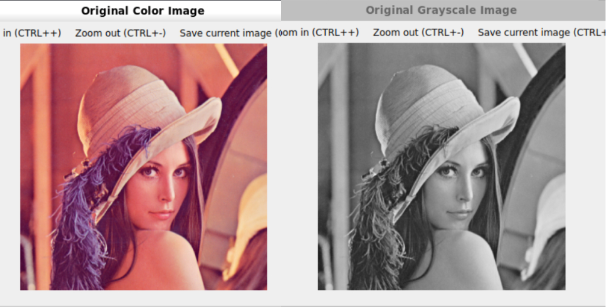
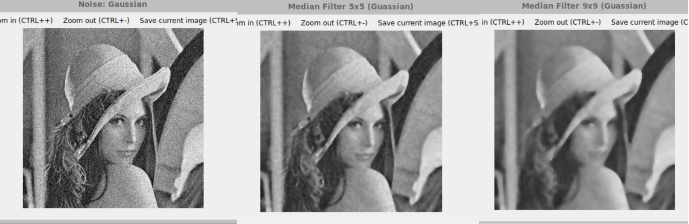
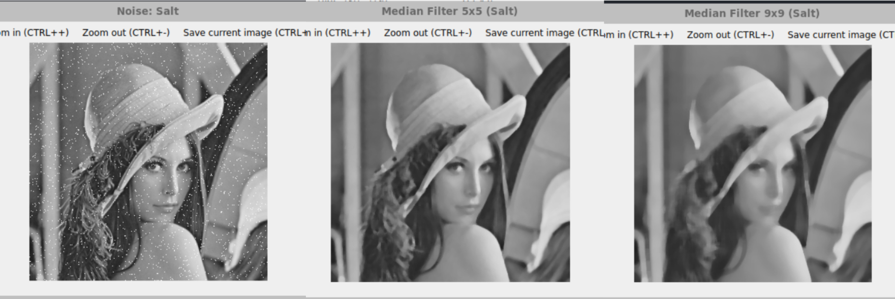
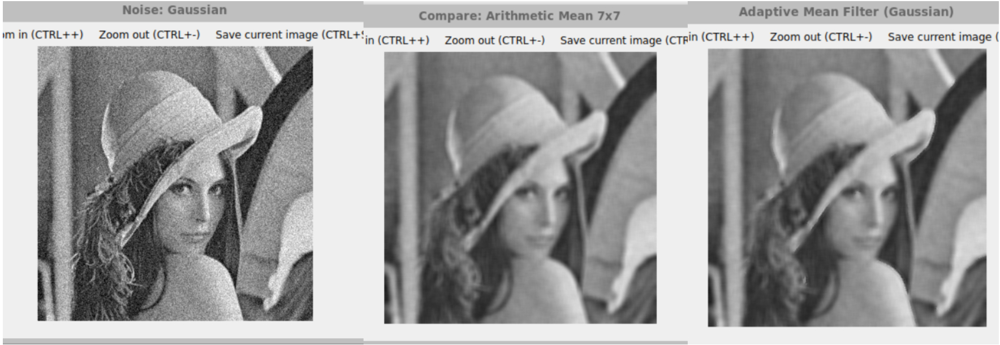
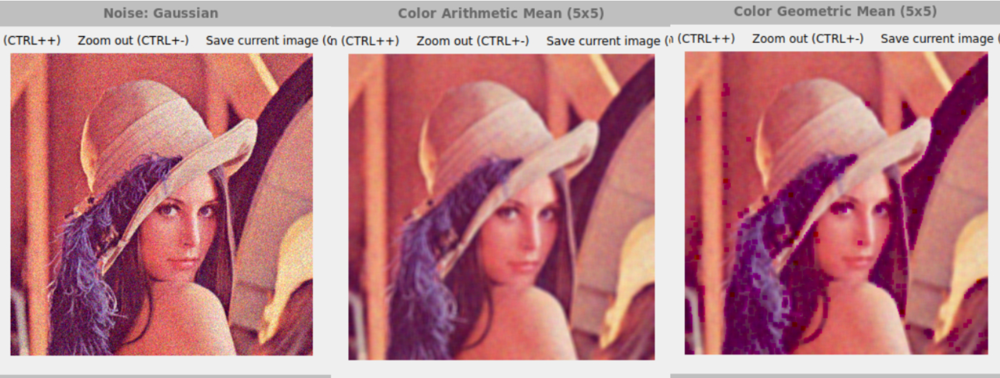

#   **高级图像处理与分析课程实验报告**

 **学号：SA25225261 姓名：吕智 日期：2025.11.10**


# **实验4：图像去噪**

### **一、实验内容**

1. 均值滤波 

​	具体内容：利用$OpenCV$对灰度图像像素进行操作，分别利用算术均值滤波器、 几何均值滤波器、 谐波和逆谐波均值滤波器进行图像去噪。 模板大小为$5 * 5$。（注： 请分别为图像添加高斯噪声、 胡椒噪声、 盐噪声和椒盐噪声， 并观察滤波效果）

2. 中值滤波 

​	具体内容：利用 $OpenCV$ 对灰度图像像素进行操作，分别利用 5∗5 和 9∗9尺寸的模板对图像进行中值滤波。（注： 请分别为图像添加胡椒噪声、 盐噪声和椒盐噪声， 并观察滤波效果）

3. 自适应均值滤波

​	具体内容：利用$ OpenCV$ 对灰度图像像素进行操作， 设计自适应局部降低噪声滤波器去噪算法。 模板大小$7*7$（对比该算法的效果和均值滤波器的效果）

4. 自适应中值滤波 

​	具体内容：利用$ OpenCV $对灰度图像像素进行操作，设计自适应中值滤波算法对椒盐图像进行去噪。 模板大小$7*7$（对比中值滤波器的效果）

5. 彩色图像均值滤波 

​	具体内容：利用 $OpenCV $对彩色图像 RGB 三个通道的像素进行操作， 利用算术均值滤波器和几何均值滤波器进行彩色图像去噪。 模板大小为$5*5$。

### **二、实验完成情况**

​	当一幅图像仅被加性噪声退化时，可用空间滤波的方法来估计$f(x,y)$（即对图像$g(x,y)$去噪）

##### 1. 噪声模型

​	数字图像的噪声源主要出现在图像获取和传输过程中。例如，再获取图像过程中，成像传感器的性能主要受各种环境因素和传感元件本身的质量影响。假设噪声与空间坐标无关，并且与图像本身也不相关。噪声分量中的灰度值可视为随机变量，而随机变量可由概率密度函数（PDF）来表征。

###### 1.1高斯噪声

​	高斯随机变量$z$的PDF为 $$ p(z) = \frac{1}{\sqrt{2\pi}\sigma}e^{-\frac{(z-\bar z)^2}{2{\sigma}^2}} \tag {4.1} $$ 式中，$z$表示灰度，$\bar z$是$z$的均值，$\sigma$是$z$的标准差。添加加性高斯噪声的函数如下：

```cpp
//添加高斯噪声
Mat addGuassNoise(const Mat& gray_image,double mu,double sigma){
    Mat noise;
    noise.create(gray_image.size(),CV_32FC1);
    randn(noise, mu, sigma); //在noise矩阵中生成符合高斯分布的随机数
    Mat noise_image;
    gray_image.convertTo(noise_image, CV_32FC1);
    for (int i = 0; i < noise_image.rows; ++i) {
        // 获取每一行的指针
        float* p_dst = noise_image.ptr<float>(i);  
        const float* p_noise = noise.ptr<float>(i);  
        for (int j = 0; j < gray_image.cols; ++j) 
            p_dst[j] += p_noise[j]; //添加噪声    
    }
    noise_image.convertTo(noise_image, CV_8UC1, 1.0, 0.0);
    return noise_image;
}
```

###### 1.2椒盐噪声

​	椒盐噪声的PDF为 
$$
p(z) = \begin{cases} P_s&z = 2^k-1\\  P_p&z = 0 \\ 1 - (P_s + P_p)&  z = V \end{cases}
$$
式中，$V$是区间$0 < V < 2^k-1$内的任意整数。令$η(x,y)$表示一幅椒盐噪声图像，其密度值满足上式，我们用它来污染一幅等大小的图像$f(x,y)$，方法是$f$中$η$为0的所有位置赋0值，在$f$中$η$为$2^k-1$的所有位置赋$2^k-1$值，保留$f$中$η$为$V$的所有位置值不变。像素被胡椒或者盐粒污染的概率称为噪声密度，表示有多少百分比的像素被椒盐噪声污染，添加椒盐噪声的函数如下：

```cpp
//添加椒盐噪声
Mat addSaltAndPepperNoise(const Mat& gray_image,double density){
    Mat noise_image = gray_image.clone();
    RNG rng(getTickCount());
    int amount = (int)(gray_image.total()*density); //总像素数
    for (int k = 0; k < amount; ++k) {
        int i = rng.uniform(0, gray_image.rows);  // 行坐标
        int j = rng.uniform(0, gray_image.cols);  // 列坐标
        // 获取当前行的指针
        uchar* p_noise_row = noise_image.ptr<uchar>(i);
        const uchar* p_gray_row = gray_image.ptr<uchar>(i);
        if (rng.uniform(0, 2) == 0) 
            p_noise_row[j] = 255;
        else
            p_noise_row[j] = 0;
    }
    return noise_image;
}
```

###### 1.3胡椒噪声

​	胡椒噪声在图像中呈现黑色，灰度为0，具体添加胡椒噪声的代码如下：

```cpp
//添加椒噪声
Mat addPepperNoise(const Mat& gray_image,double density){
    Mat noise_image = gray_image.clone();
    RNG rng(getTickCount());
    int amount = (int)(gray_image.total()*density); //总像素数
    for (int k = 0; k < amount; ++k) {
        int i = rng.uniform(0, gray_image.rows);  // 行坐标
        int j = rng.uniform(0, gray_image.cols);  // 列坐标
        // 获取当前行的指针
        uchar* p_noise_row = noise_image.ptr<uchar>(i);
        const uchar* p_gray_row = gray_image.ptr<uchar>(i);
        p_noise_row[j] = 0; //椒噪声，黑色，0
    }
    return noise_image;
}
```

###### 1.3盐噪声

​	盐噪声在图像中呈现白色，灰度为255，具体添加盐噪声的代码如下：

```cpp
//添加盐噪声
Mat addSaltNoise(const Mat& gray_image,double density){
    Mat noise_image = gray_image.clone();
    RNG rng(getTickCount());
    int amount = (int)(gray_image.total()*density); //总像素数
    for (int k = 0; k < amount; ++k) {
        int i = rng.uniform(0, gray_image.rows);  // 行坐标
        int j = rng.uniform(0, gray_image.cols);  // 列坐标
        // 获取当前行的指针
        uchar* p_noise_row = noise_image.ptr<uchar>(i);
        const uchar* p_gray_row = gray_image.ptr<uchar>(i);
        p_noise_row[j] = 255; //盐噪声，白色，255
    }
    return noise_image;
}
```

##### 2. 均值滤波

###### 2.1算术均值滤波器

​	算术均值滤波器是最简单的均值滤波器，它在由$S_{xy}$定义的区域中，计算被污染图像$g(x,y)$的平均值。复原的图像$\hat{f}$在$(x,y)$处的值使用该区域中像素的算术平均值，即 $$ \hat{f}(x,y) = \frac{1}{mn} \sum_{(r,c)\in{S_{xy}}}g(r,c) \tag{4.3} $$ 式中，$r$和$c$是邻域中所包含像素的行坐标和列坐标。这一运算可以使用大小为$m \times n$，所有系数都是$\frac{1}{mn}$​的一个空间核来实现。均值滤波平滑图像中的局部变化，它会降低图像中的噪声，但会模糊图像。实现代码如下：

```cpp
//算术均值滤波器
void arithmeticMeanFilter(const Mat& gray_image,Mat& filtered_image,int k){
    filtered_image.create(gray_image.size(),gray_image.type());
    int half = k / 2;
    int window_pixels = k * k; //矩形子图窗口中的像素个数

    Mat padded_image;//填充图像
    copyMakeBorder(gray_image,padded_image,half,half,half,half,BORDER_REFLECT);
    for (int i = 0; i < gray_image.rows; ++i) {
        uchar* p_dst = filtered_image.ptr<uchar>(i);  // 获取目标图像的行指针
        for (int j = 0; j < gray_image.cols; ++j) {
            //(i,j) 为待滤波图像的中心，(I,J)为(i,j)在填充图像padded_image中的位置
            int I = i + half;
            int J = j + half;
            double sum = 0.0; //窗口内的像素和
            //遍历矩形子图窗口
            for (int u = -half; u <= half; ++u) {
                const uchar* p_src_row = padded_image.ptr<uchar>(I + u); // 获取填充图像的局部行指针
                for (int v = -half; v <= half; ++v)
                    sum += p_src_row[J + v]; 
            }
            double arithmetic_mean = sum / window_pixels;   //算术均值 = (1/mn) * Sum
            p_dst[j] = saturate_cast<uchar>(arithmetic_mean);
        }
    }
}
```

###### 2.2几何均值滤波器

​	使用几何均值滤波器复原的图像由下式给出 
$$
f(x,y) = \left[ \prod_{(r,c) \in S_{xy}}g(r,c) \right]^\frac{1}{mn}
$$
每个复原的像素是图像区域中所有像素之积的$\frac{1}{mn}$次幂。几何均值滤波器的平滑可与算术平均滤波器相比，但损失的图像细节更少。由于几何均值滤波器做的是乘积开方运算，可以很容易的想到将其变成对数来简化运算，使乘法变成加法，幂次变为乘除运算。几何均值滤波器的实现如下:

```cpp
//几何均值滤波器
void geometricMeanFilter(const Mat& gray_image, Mat& filtered_image, int k) {
    filtered_image.create(gray_image.size(), gray_image.type());
    int half = k / 2;
    int window_pixels = k * k; // 矩形子图窗口中的像素个数

    Mat padded_image; // 填充图像
    copyMakeBorder(gray_image, padded_image, half, half, half, half, BORDER_REFLECT);
    for (int i = 0; i < gray_image.rows; ++i) {
        uchar* p_dst = filtered_image.ptr<uchar>(i);  // 获取目标图像的行指针
        for (int j = 0; j < gray_image.cols; ++j) {
            // (i,j) 为待滤波图像的中心，(I,J)为(i,j)在填充图像padded_image中的位置
            int I = i + half;
            int J = j + half;
            double product_log = 0.0; // 像素积，使用对数变为加法，防止乘法产生溢出
            bool has_zero = false;
            //遍历矩形子图窗口
            for (int u = -half; u <= half; ++u) {
                const uchar* p_src_row = padded_image.ptr<uchar>(I + u); // 获取填充图像的局部行指针
                for (int v = -half; v <= half; ++v) {
                    uchar val = p_src_row[J + v]; 
                    if (val == 0) {
                        has_zero = true; //当有值为0时，则乘积为0，直接退出循环
                        break;
                    }
                    product_log += log((double)val); //乘法运算可以变成对数的加法运算
                }
                if (has_zero) break;
            }
            double geometric_mean; //几何均值
            if (has_zero)
                geometric_mean = 0.0;
            else 
                geometric_mean = exp(product_log / window_pixels);//几何均值 = exp((1/mn) * Sum(Log(value)))
            p_dst[j] = saturate_cast<uchar>(geometric_mean);
        }
    }
}
```

###### 2.3谐波均值滤波器

​	谐波平均滤波器由下式给出 
$$
f(x,y) = \frac{mn}{\sum_{(r,c) \in {S_{xy}}} \frac{1}{g(r,c)}}
$$
谐波平均滤波器既能处理盐粒噪声，又能处理高斯噪声。但不能处理胡椒噪声。实现代码如下：

```cpp
//谐波平均滤波器
void harmonicMeanFilter(const Mat& gray_image, Mat& filtered_image, int k) {
    filtered_image.create(gray_image.size(), gray_image.type());
    int half = k / 2;
    int window_pixels = k * k; // 矩形子图窗口中的像素个数

    Mat padded_image; // 填充图像
    copyMakeBorder(gray_image, padded_image, half, half, half, half, BORDER_REFLECT);
    for (int i = 0; i < gray_image.rows; ++i) {
        uchar* p_dst = filtered_image.ptr<uchar>(i);  // 获取目标图像的行指针
        for (int j = 0; j < gray_image.cols; ++j) {
            // (i,j) 为待滤波图像的中心，(I,J)为(i,j)在填充图像padded_image中的位置
            int I = i + half;
            int J = j + half;
            double sum_reciprocal = 0.0; // 表示像素的倒数之和
            bool has_zero = false; //判断像素是不是0，像素是0时，倒数是无穷大，此时倒数和为无穷大，谐波均值为0
            //遍历矩形子图窗口
            for (int u = -half; u <= half; ++u) {
                const uchar* p_src_row = padded_image.ptr<uchar>(I + u); // 获取填充图像的局部行指针
                for (int v = -half; v <= half; ++v) {
                    uchar val = p_src_row[J + v];
                    if (val == 0) {
                        has_zero = true; // 倒数无限大，结果为 0
                        break;
                    }
                    sum_reciprocal += 1.0 / val; //倒数求和
                }
                if (has_zero) break;
            }
            double harmonic_mean; //谐波均值
            if (has_zero || sum_reciprocal == 0.0) //当has_zero时，谐波均值为0；当sum_reciprocal为0时，谐波均值无穷达，无意义
                harmonic_mean = 0.0;
            else 
                harmonic_mean = (double)window_pixels / sum_reciprocal; // 谐波均值 = m*n / (倒数之和)
            p_dst[j] = saturate_cast<uchar>(harmonic_mean);
        }
    }
}
```

###### 2.4反谐波均值滤波器

​	反谐波平均滤波器由下式给出
$$
f(x,y) = \frac{\sum_{(r,c) \in S_{xy}} g(r,c)^{Q+1}}{\sum_{(r,c) \in S_{xy}} g(r,c)^Q}
$$
其中，Q称为滤波器阶数。这种滤波器适用于消除椒盐噪声。$Q>0$时，该滤波器消除胡椒噪声；$Q<0$时 ，该滤波器消除盐粒噪声。但不能同时消除这两种噪声。当$Q=0$时，该滤波器简化为算术平均滤波器；$Q=-1$时，该滤波器简化为谐波平均滤波器。实现代码如下：

```cpp
//反谐波平均滤波器，Q为阶数，Q为正，消除胡椒噪声，Q为负，消除盐噪声
void contraHarmonicMeanFilter(const Mat& gray_image, Mat& filtered_image, int k, double Q) {
    filtered_image.create(gray_image.size(), gray_image.type());
    int half = k / 2;
    
    Mat padded_image; // 填充图像
    copyMakeBorder(gray_image, padded_image, half, half, half, half, BORDER_REFLECT);
    for (int i = 0; i < gray_image.rows; ++i) {
        uchar* p_dst = filtered_image.ptr<uchar>(i);  // 获取目标图像的行指针
        for (int j = 0; j < gray_image.cols; ++j) {
            // (i,j) 为待滤波图像的中心，(I,J)为(i,j)在填充图像padded_image中的位置
            int I = i + half;
            int J = j + half;   
            double sum_numerator = 0.0;     // 表示分子，r^(Q+1) 之和
            double sum_denominator = 0.0;   // 表示分母，r^Q 之和
            //遍历矩形子图窗口
            for (int u = -half; u <= half; ++u) {
                const uchar* p_src_row = padded_image.ptr<uchar>(I + u); // 获取填充图像的局部行指针
                for (int v = -half; v <= half; ++v) {
                    double val = (double)p_src_row[J + v];
                    sum_numerator += pow(val, Q + 1);
                    sum_denominator += pow(val, Q);
                }
            }
            double contra_harmonic_mean; //反谐波均值
            if (sum_denominator != 0.0) //分母不为0，才有意义
                contra_harmonic_mean = sum_numerator / sum_denominator; // 反谐波均值 = sum(r^(Q+1)) / sum(r^Q)
            else 
                contra_harmonic_mean = 0.0; 
            p_dst[j] = saturate_cast<uchar>(contra_harmonic_mean);
        }
    }
}
```

##### 3. 中值滤波

​	中值滤波器是最著名的统计排序滤波器，它用一个预定义的像素邻域中的灰度中值来替代像素的值，即下式：
$$
f(x,y) = \mathop{\text{median}}_{(r,c) \in S_{xy}} \left\{ g(r,c) \right\}
$$
中值滤波器应用广泛，因为与大小相同的线性平滑滤波器相比，它能有效地降低某些随机噪声，且模糊度要小得多。对于单极和双极冲激噪声，中值滤波器的效果更好。基本的中值滤波器实现代码如下：

```cpp
//中值滤波器(统计排序滤波器)
void meanFilter(const Mat& gray_image, Mat& filtered_image, int k){
    filtered_image.create(gray_image.size(), gray_image.type());
    int half = k / 2;

    Mat padded_image; // 填充图像
    copyMakeBorder(gray_image, padded_image, half, half, half, half, BORDER_REFLECT);
    for (int i = 0; i < gray_image.rows; ++i) {
        uchar* p_dst = filtered_image.ptr<uchar>(i);  // 获取目标图像的行指针
        for (int j = 0; j < gray_image.cols; ++j) {
            // (i,j) 为待滤波图像的中心，(I,J)为(i,j)在填充图像padded_image中的位置
            int I = i + half;
            int J = j + half;
            vector<uchar> window_values; // 存储子图窗口内的像素值
            //遍历矩形子图窗口
            for (int u = -half; u <= half; ++u) {
                const uchar* p_src_row = padded_image.ptr<uchar>(I + u); // 获取填充图像的局部行指针
                for (int v = -half; v <= half; ++v)
                    window_values.push_back(p_src_row[J + v]); // 将窗口内的像素值存入vector
            }
            std::sort(window_values.begin(), window_values.end()); //对窗口内的像素值排序
            uchar median_value = window_values[window_values.size() / 2]; //取中值
            p_dst[j] = median_value; //图像位置变为窗口中值
        }
    }
}
```

##### 4. 自适应均值滤波

​	自适应滤波器的特性会根据$m \times n$矩形邻域$S_{xy}$定义的滤波区域内的图像的统计特性变化。自适应局部降噪滤波器具有如下性能：（1）若$\sigma_{\eta}^2$为$0$，则滤波器返回$(x,y)$处的值$g$。因为噪声为$0$时，$(x,y)$处的$g$等于$f$。（2）若局部方差$\sigma_{S_{xy}}^2$与$\sigma_{\eta}^2$高度相关，则滤波器返回$(x,y)$处的一个接近于$g$的值。高局部方差通常与边缘相关，且应保留这些边缘。（3）若两个方差相等，则希望滤波器返回$S_{xy}$​中像素的算术平均值。当局部区域的性质与整个图像的性质相同时会出现这个条件，且平均运算会降低局部噪声。根据这些假设得到的$\hat f(x,y)$的自适应表达式可以写为
$$
f(x,y) = g(x,y) - \frac{\sigma_{\eta}^2}{\sigma_{S_{xy}}^2}[g(x,y) - \bar z_{S_{xy}}]
$$
$σ^{2}_{η}$​由噪声图像估计得到,其中$r_i$为像素，m为全图均值，$p(r_i)$为灰度概率：
$$
σ^{2}_{η}=\sum_{i=0}^{L-1}(r_i-m)^2p(r_i)
$$
其他参数由邻域$S_{xy}$​中的像素计算得到：
$$
\bar z_{S_{xy}} = \sum_{i=0}^{L-1}r_ip_{S_{xy}}(r_i)
$$

$$
σ^2_{S_xy}=\sum_{i=0}^{L-1}(r_i-m_{S_{xy}})^2p_{S_{xy}}(r_i)
$$

注意当$\sigma_{\eta}^2>\sigma_{S_{xy}}^2$时比率应设为$1$，这样可以阻止因缺少图像噪声方差的知识而产生无意义的结果。基于上述思路实现的自适应均值滤波器实现如下:

```cpp
//自适应均值滤波器
void adaptiveMeanFilter(const Mat& gray_image, Mat& filtered_image, int k) {
    filtered_image.create(gray_image.size(), gray_image.type());
    int half = k / 2;
    int window_pixels = k * k; 

    Mat padded_image; // 填充图像
    copyMakeBorder(gray_image, padded_image, half, half, half, half, BORDER_REFLECT);
    
    //计算噪声图像的方差
    double sum_gray = 0.0;
    double mean_gray = 0.0;
    double sigma_n2 = 0.0;
    for (int i = 0; i < gray_image.rows; ++i){
        const uchar* p_src = gray_image.ptr<uchar>(i);
        for (int j = 0; j < gray_image.cols; ++j)
            sum_gray += p_src[j];
    }
    mean_gray = sum_gray / gray_image.total(); //得到均值
    sum_gray = 0.0;
    for (int i = 0; i < gray_image.rows; ++i) {
        const uchar* p_src = gray_image.ptr<uchar>(i);
        for (int j = 0; j < gray_image.cols; ++j) {
            double diff = p_src[j] - mean_gray;  // 像素值与均值的差
            sum_gray += diff * diff;  // 累加平方差
        }
    }
    sigma_n2 = sum_gray / gray_image.total(); // 得到噪声方差

    for (int i = 0; i < gray_image.rows; ++i) {
        uchar* p_dst = filtered_image.ptr<uchar>(i); // 获取目标图像的行指针
        for (int j = 0; j < gray_image.cols; ++j) {
            int I = i + half;
            int J = j + half;
            
            double z_mean = 0.0; // 表示局部平均灰度z_mean
            vector<double> window_values; //向量存储窗口中的像素值
            //遍历子窗口
            for (int u = -half; u <= half; ++u) {
                const uchar* p_src_row = padded_image.ptr<uchar>(I + u);
                for (int v = -half; v <= half; ++v) {
                    double val = (double)p_src_row[J + v];
                    window_values.push_back(val);
                    z_mean += val;
                }
            }
            z_mean /= window_pixels; // 局部平均灰度

            double sigma_S2 = 0.0; //局部方差
            for (double val : window_values) {
                double diff = val - z_mean;
                sigma_S2 += diff*diff;
            }
            sigma_S2 /= window_pixels; // 局部方差

            // 使用自适应表达式
            double g_xy = (double)gray_image.ptr<uchar>(i)[j]; // 原始像素值 g(x,y)
            double result;
            if(sigma_n2 <= sigma_S2){
                double ratio = sigma_n2 / sigma_S2;
                result = g_xy - ratio * (g_xy - z_mean); //自适应表达式
            }else
                result = z_mean; // 违反条件时，比率设置为1，即g_xy-g_xy+z_mean,阻止产生无意义的结果
            p_dst[j] = saturate_cast<uchar>(result);
        }
    }
}
```

##### 5. 自适应中值滤波

​	自适应中值滤波能够处理具有更大概率的噪声，且会在试图保留图像细节的同时平滑非冲激噪声。自适应中值滤波器也工作在矩形邻域$S_{xy}$内，但是它会根据下面列出的一些条件来改变$S_{xy}$的大小。自适应中值滤波器的工作原理如下：

​		层次A：若$z_{min} < z_{med} < z_{max}$，则转到层次B

 		否则，增大$S_{xy}$的尺寸

​		 若$S_{xy} \le S_{max}$，则重复层次A

​		 否则，输出$z_{med}$

​		层次B：若$z_{min} < z_{xy} < z_{max}$，则输出$z_{xy}$

 		否则，输出$z_{med}$

其中，$z_{min}$是$S_{xy}$中的最小灰度值；$z_{max}$是$S_{xy}$中的最大灰度值；$z_{med}$是$S_{xy}$中的灰度值的中值；$z_{xy}$是坐标$(x,y)$处的灰度值；$S_{max}$是$S_{xy}$的最大允许尺寸。基于上述思路实现的代码如下：

```cpp
//自适应中值滤波器
void adaptiveMedianFilter(const Mat& gray_image, Mat& filtered_image, int Smax) {
    filtered_image.create(gray_image.size(), gray_image.type());
    int half = Smax / 2; 
    Mat padded_image;
    copyMakeBorder(gray_image, padded_image, half, half, half, half, BORDER_REFLECT);// 填充图像，使用 Smax 作为最大边界

    for (int i = 0; i < gray_image.rows; ++i) {
        uchar* p_dst = filtered_image.ptr<uchar>(i); // 获取目标图像的行指针
        for (int j = 0; j < gray_image.cols; ++j) {
            int I = i + half; // 中心行在填充图像中的位置
            int J = j + half; // 中心列在填充图像中的位置
            int k = 3; // 从 3x3 开始增加尺寸        
            // 层次A: 找到有效中值
            uchar z_med = 0;
            bool is_found = false;
            while (k <= Smax) {
                int new_half = k / 2;
                vector<uchar> window_values; // 当前窗口中的像素
                // 遍历当前子窗口
                for (int u = -new_half; u <= new_half; ++u) {
                    const uchar* p_src_row = padded_image.ptr<uchar>(I + u);
                    for (int v = -new_half; v <= new_half; ++v)
                        window_values.push_back(p_src_row[J + v]);
                }
                std::sort(window_values.begin(), window_values.end()); //当前窗口的像素排序
                uchar z_min = window_values.front(); 
                uchar z_max = window_values.back();
                z_med = window_values[window_values.size() / 2]; //窗口中值
                // 层次A判断是否满足z_min<z_med<z_max来跳转到层次B
                if (z_med> z_min && z_med < z_max) {
                    // 跳转到层次B
                    uchar z_xy = gray_image.ptr<uchar>(i)[j]; // 原始中心像素值z_xy
                    if (z_xy > z_min && z_xy < z_max) //层次B判断是否满足z_min<z_xy<z_max
                        p_dst[j] = z_xy; //输出z_xy
                    else 
                        p_dst[j] = z_med; //否则输出z_med
                    is_found = true;
                    break; // 处理下一个像素
                } else
                    k += 2; //不能跳转层次B，则增加窗口尺寸
            }
            if(!is_found)
                p_dst[j] = z_med; // 如果窗口增大到 Smax 仍未满足条件，则直接输出 Smax 窗口的中值
        }
    }
}
```

##### 6. 彩色图像均值滤波

​	对彩色图像添加高斯噪声的代码如下，三个通道分别添加高斯噪声：

```cpp
// 为彩色图像添加高斯噪声
Mat addColorGaussianNoise(const Mat& color_image, double mu, double sigma) {
    CV_Assert(color_image.type() == CV_8UC3);
    vector<Mat> bgr_channels;
    split(color_image, bgr_channels); // 分离通道

    // 对每个通道应用灰度噪声函数
    for (int i = 0; i < 3; ++i) 
        bgr_channels[i] = addGuassNoise(bgr_channels[i], mu, sigma);

    Mat noisy_color_image;
    merge(bgr_channels, noisy_color_image); // 合并通道
    return noisy_color_image;
}
```

同样的，对彩色图像进行去噪时，也要分三个通道分别调用算术均值滤波或者几何均值滤波，彩色图像均值滤波代码复用灰度图像的均值滤波：

```cpp
//彩色图像算术均值滤波
void colorArithmeticMeanFilter(const Mat& color_image, Mat& filtered_image, int k) {
    CV_Assert(color_image.type() == CV_8UC3);
    
    vector<Mat> bgr_channels;
    split(color_image, bgr_channels); // 分离通道
    
    Mat filtered_channels[3];
    for (int i = 0; i < 3; ++i)
        arithmeticMeanFilter(bgr_channels[i], filtered_channels[i], k); //对每个通道调用灰度算术均值滤波函数

    vector<Mat> result_channels = {filtered_channels[0], filtered_channels[1], filtered_channels[2]};
    merge(result_channels, filtered_image);  // 合并通道
}

//彩色图像几何均值滤波
void colorGeometricMeanFilter(const Mat& color_image, Mat& filtered_image, int k) {
    CV_Assert(color_image.type() == CV_8UC3);
    
    vector<Mat> bgr_channels;
    split(color_image, bgr_channels); // 分离通道
    
    Mat filtered_channels[3];
    for (int i = 0; i < 3; ++i)
        geometricMeanFilter(bgr_channels[i], filtered_channels[i], k);// 对每个通道调用灰度几何均值滤波函数
    
    vector<Mat> result_channels = {filtered_channels[0], filtered_channels[1], filtered_channels[2]};
    merge(result_channels, filtered_image); // 合并通道
}
```

### **三、实验结果**

首先，先给出传入图像的彩色图像和灰度图像：



##### 1. 均值滤波

下面是使用算术均值和几何均值对施加高斯噪声的灰度图像处理的结果。可以看出算术均值滤波和几何均值滤波对高斯噪声具有一定的平滑作用，有效降低了噪声，但同时带来了明显的图像模糊。


下面是使用算术均值和几何均值对施加椒盐噪声的灰度图像处理的结果。算术均值滤波对椒盐噪声的处理效果不理想，虽然噪声强度有所降低，但图像依旧模糊；几何均值滤波对椒盐噪声的去除效果比算术均值更差，图像中出现了大量黑色方块，由于几何均值滤波其对 0 值极其敏感，滤波窗口中出现了0，则该像素位置就会变为0，所以不适合处理脉冲噪声。


下面是使用谐波均值对胡椒噪声和盐粒噪声处理的结果。谐波均值滤波对盐粒噪声的处理效果较好，能有效去除亮色噪点，谐波均值滤波对胡椒噪声的处理效果非常差，导致大量区域被黑色方块覆盖。


下面是使用反谐波均值对胡椒噪声和盐粒噪声处理的结果。反谐波均值滤波$(Q>0)$对胡椒噪声的处理效果较好，能有效去除暗色噪点。

反谐波均值滤波（$Q<0$）对盐粒噪声的处理效果较好，能去除亮色噪点。当$(Q=-1)$时，反谐波均值效果相当于谐波均值。


##### 2. 中值滤波

下面是使用中值滤波的$5×5$和$9×9$模板对高斯噪声处理的结果，中值滤波在处理高斯噪声时，相较于均值滤波，去噪能力较弱，图像中仍有明显的颗粒感。



下面是使用中值滤波的$5×5$和$9×9$模板对椒盐噪声处理的结果，中值滤波对椒盐噪声的去除效果非常出色，能够有效地消除图像中的椒盐噪声，同时较好地保留了边缘信息。


下面是使用中值滤波的$5×5$和$9×9$模板对胡椒噪声处理的结果


下面是使用中值滤波的$5×5$和$9×9$​模板对盐粒噪声处理的结果



从上面的中值滤波对胡椒噪声和盐粒噪声的处理可以看出，中值滤波对单极性脉冲噪声（胡椒或盐粒）同样表现出极好的去除效果，几乎完全清除了噪点。且中值滤波模板随着模板尺寸的增大(从5到9)，会使图像更加平滑，但也会导致更多的模糊和细节丢失。

##### 3. 自适应均值滤波

下面是使用自适应均值滤波的$7×7$和算术均值模板的$7×7$模板对高斯噪声处理的结果，自适应均值滤波在去除高斯噪声时，较为优于普通的固定尺寸算术均值滤波，保留了更多的细节。



##### 4. 自适应中值滤波

下面是使用自适应中值滤波的$7×7$和算术均值模板的$7×7$模板对椒盐噪声处理的结果，自适应中值滤波在去除椒盐噪声时，效果显著优于固定尺寸的中值滤波，它不仅彻底去除了噪声，而且最大限度地保留了图像的细节。


##### 5. 彩色图像均值滤波

下面是对施加高斯噪声的彩色图像进行算术均值和几何均值滤波的结果，滤波模板采用$5×5$大小。



算术均值和几何均值滤波对高斯噪声具有明显的平滑效果，成功去除了大部分彩色噪点。但与灰度图像处理类似，它带来了显著的图像模糊和细节损失。
