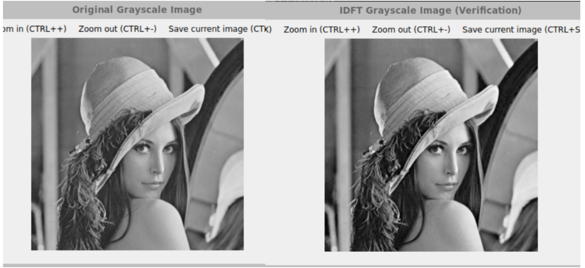
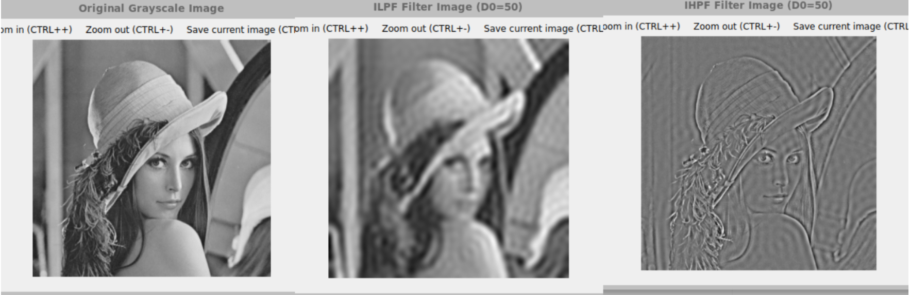
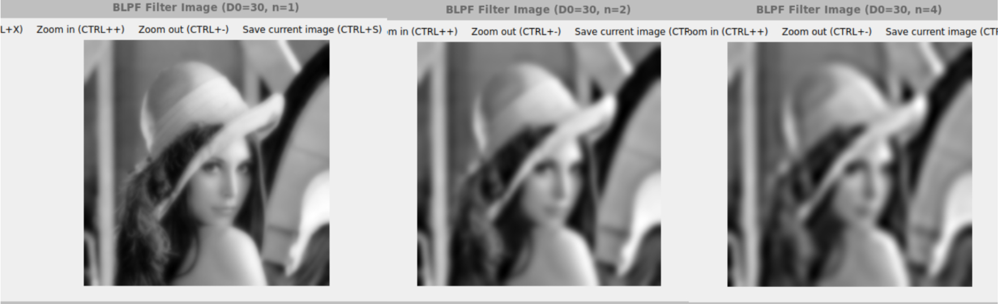
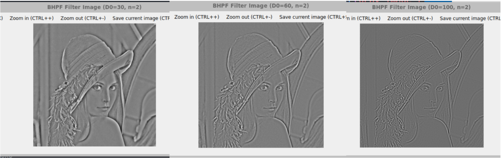

#   **高级图像处理与分析课程实验报告**

 **学号：SA25225261 姓名：吕智 日期：2025.11.7**


# **实验5：频域滤波**

### **一、实验内容**

1. 灰度图像的$DFT$和$IDFT$ 

​	具体内容：利用$OpenCV$提供的$dft$函数对图像进行$DFT$和$IDFT$变换 

2. 利用理想高通和低通滤波器对灰度图像进行频域滤波 

​	具体内容：利用$dft$函数实现$DFT$，在频域上利用理想高通和低通滤波器进行滤波，并把滤波过后的图像显示在屏幕上（观察振铃现象），要求截止频率可输入

3. 利用布特沃斯高通和低通滤波器对灰度图像进行频域滤波 

​	具体内容：利用$dft$函数实现$DFT$，在频域上进行利用布特沃斯高通和低通滤波器进行滤波，并把滤波过后的图像显示在屏幕上（观察振铃现象），要求截止频率和$n$可输入。

### **二、实验完成情况**

##### 1.灰度图像的$DFT$和$IDFT$

​	使用如下的傅里叶变换可以将图像从空间域转换到频率域
$$
F(u,v)=\sum_{x=0}^{M-1}\sum_{y=0}^{N-1}f(x,y)e^{-j2\pi(ux/M+vy/N)}
$$
其中$f(x,y)$是大小为$M \times N$的输入图像。而已知$F(u,v)$时，可以用傅里叶反变换得到$f(x,y)$​
$$
f(x,y)=\frac{1}{MN}\sum_{u=0}^{M-1}\sum_{v=0}^{N-1}F(u,v)e^{j2\pi(ux/M+vy/N)}
$$
在$opencv$中，可以使用`dft()`函数来完成傅里叶变换和傅里叶反变换，它的参数分别为原矩阵，目标矩阵，变换标志。其中变换标志默认不填时为正变换，当填写`DFT_INVERSE`时为反变换。采用书上182页到183页频域滤波的过程1，2，3，4，7来实现图像的$DFT$和$IDFT$：

​	步骤1. 填充原图尺寸为$P=2M,Q=2N$，得到填充后的图像$f_p$；

​	步骤2. 将$fp(x,y)$乘以$(-1)^{(x+y)}$，使傅里叶变换位于$P×Q$大小的频率矩形的中心; 

​	步骤3. 计算 $DFT$; 

​	步骤4. 分离和显示频谱;

​	步骤5. 进行$IDFT$​​；

​	步骤6. 反中心化和裁剪到原始 $M x N$ 尺寸

​	步骤7. 将像素归一化到0-255范围内

具体代码如下：

```cpp
//DFT 和 IDFT
void DFTAndIDFT(const Mat& gray_image){
    const int M = gray_image.rows; 
    const int N = gray_image.cols;
    // 1.填充原图尺寸为P=2M,Q=2N
    const int P = M * 2;
    const int Q = N * 2;
    Mat fp;
    Mat temp;
    copyMakeBorder(gray_image, temp, 0, P - M, 0, Q - N, BORDER_CONSTANT, Scalar::all(0));
    temp.convertTo(fp, CV_32F); 
    // 2. 将fp(x,y)乘以(-1)^(x+y)，使傅里叶变换位于P×Q大小的频率矩形的中心
    for (int i = 0; i < P; i++) {
        for (int j = 0; j < Q; j++) {
            if ((i + j) % 2 != 0) 
                fp.at<float>(i, j) = -fp.at<float>(i, j);
        }
    }
    // 3 计算 DFT: F (P x Q, CV_32FC2)
    Mat real_image[2]; 
    real_image[0] = fp; 
    real_image[1] = Mat::zeros(fp.size(), CV_32F); 
    Mat F;
    merge(real_image, 2, F);
    dft(F, F);
    // 4 分离和显示频谱
    split(F, real_image); 
    Mat complex_dft_copy;
    merge(real_image, 2, complex_dft_copy); // 使用复数来绘制频谱
    Mat mag_spectrum = getMagnitudeSpectrum(complex_dft_copy);
    showAndWait("DFT Magnitude Spectrum", mag_spectrum);
    // 5 IDFT 验证
    Mat G;
    merge(real_image, 2, G); // G 是 P x Q
    dft(G, G, DFT_INVERSE | DFT_SCALE); 
    split(G, real_image);
    // 6. 反中心化和裁剪到原始 M x N 尺寸
    Mat idft_image(gray_image.rows, gray_image.cols, CV_32F); 
    for (int i = 0; i < M; i++) {
        for (int j = 0; j < N; j++) {
            float val = real_image[0].at<float>(i, j); 
            if ((i + j) % 2 != 0)
                idft_image.at<float>(i, j) = -val; //反中心化 f'(x,y) * (-1)^(x+y) = f(x,y)
            else
                idft_image.at<float>(i, j) = val;
        }
    }
    // 7. 归一化并显示
    normalize(idft_image, idft_image, 0, 255, NORM_MINMAX);
    idft_image.convertTo(idft_image, CV_8U);
    showAndWait("IDFT Grayscale Image (Verification)", idft_image);
}
```

##### 2.利用理想高通和低通滤波器对灰度图像进行频域滤波

频率域滤波的步骤是，首先填充图像得到$f_p(x,y)$，再将$f_p(x,y)$进行中心化，即$f_p(x,y)(-1)^{(x+y)}$。再对扩充后的图像进行傅里叶变换，此时可以得到$F(u,v)$。

构建一个实对称滤波器传递函数$H(u,v)$，对应像素相乘得到$G(u,v)=H(u,v)F(u,v)$,然后计算其反变换，得到处理后的结果的空间域表示。
$$
g(x,y)=Real\{\Im ^ {-1}[G(u,v)]\}(-1)^{x+y}
$$
最后，从$g(x,y)$的左上象限提取一个大小为$M×N$的区域，得到与输入图像大小相同的滤波后结果$g(x,y)$。

在以原点为中心的一个圆内无衰减地通过所有频率，而在这个圆外“截止”所有频率的二维低通滤波器，称为理想低通滤波器($ILPF$)，它由下面的传递函数规定：
$$
H(u,v) = 
\begin{cases}
1, \quad D(u,v) \le D_0 \\
0, \quad D(u,v) \gt D_0
\end{cases} 
$$
其中，$D_0$称为截止频率，$D(u,v)$是频率域中点$(u,v)$到$P \times Q$频率矩形中心的距离。理想低通滤波器可以用来平滑图像。像在空间域中使用核那样，在频率域中用$1$减去低通滤波器传递函数，会得到对应的高通滤波器($IHPF$)传递函数：
$$
H(u,v) = 
\begin{cases}
0, \quad D(u,v) \le D_0 \\
1, \quad D(u,v) \gt D_0
\end{cases} 
$$
##### 3.利用布特沃斯高通和低通滤波器对灰度图像进行频域滤波

截止频率位于距频率矩形中心$D_0$处的$n$阶布特沃斯低通滤波器($BLPF$)的传递函数定义为：
$$
H(u,v)=\frac {1} {1+{[D(u,v)/D_0]^{2n}}} \tag{5.5}
$$
这个函数可以用较高的$n$值来逼近$ILPF$的特性，且振铃效应要比$ILPF$小得多。由该式得到的布特沃斯高通滤波器($BHPF$)的传递函数为：
$$
H(u,v)=\frac {1} {1+{[D_0/D(u,v)]^{2n}}} \tag{5.6}
$$
使用OpenCV实现的用于计算实验内容2和实验内容3这$4$​种传递函数的函数如下：

```cpp
// 过滤器类型的枚举
enum FilterType {
    ILPF = 1,  // 理想低通
    IHPF = 2,  // 理想高通
    BLPF = 3, // 布特沃斯低通
    BHPF = 4  // 布特沃斯高通
};
// 传递函数，其中D0为截止频率，n为阶数
Mat TransferFunc(int P, int Q,FilterType type,double D0,int n){
    Mat H(P, Q, CV_32F);// 传递函数大小P×Q,中心在(P/2,Q/2)
    int centerU = Q / 2; // 对应 u 轴
    int centerV = P / 2; // 对应 v 轴
    for (int v = 0; v < P; ++v) {
        for (int u = 0; u < Q; ++u) {
            double du = (double)u - centerU; 
            double dv = (double)v - centerV; 
            double D_uv = sqrt(du * du + dv * dv);//计算距离 D(u, v)
            double H_val = 0.0; //滤波器值对应点的值
            switch (type) {
                case ILPF: // 理想低通
                    H_val = (D_uv <= D0) ? 1.0 : 0.0; //  H = 1 if D <= D0, else 0
                    break;
                case IHPF: // 理想高通
                    H_val = (D_uv > D0) ? 1.0 : 0.0; // H = 1 if D > D0, else 0
                    break;
                case BLPF: // 布特沃斯低通
                    H_val = 1.0 / (1.0 + pow(D_uv / D0, 2 * n)); //  H = 1 / (1 + (D / D0)^2n)
                    break;
                case BHPF: // 布特沃斯高通
                    if (D_uv < 1e-6) { 
                        H_val = 0.0;
                    } else {
                        H_val = 1.0 / (1.0 + pow(D0 / D_uv, 2 * n)); // H = 1 / (1 + (D0 / D)^2n)
                    }
                    break;
                default:
                    H_val = 1.0; // 全通 
                    break;
            }
            H.at<float>(v, u) = (float)H_val;
        }
    }
    return H;
}
```

实现频域滤波步骤的函数如下：

```cpp
void frequency_filter(const Mat& gray_image,Mat& filter_image,const FilterType type,const double D0,const int n){
    const Mat& f = gray_image;
    const int M = f.rows; //原图的尺寸
    const int N = f.cols;
    // 1.填充原图尺寸为P=2M,Q=2N
    const int P = f.rows * 2;   // 填充后的尺寸
    const int Q = f.cols * 2;
    // 2. 使用0填充，形成大小为P×Q的填充后图像
    Mat fp;
    Mat temp; //临时存储uchar
    copyMakeBorder(f, temp, 0, P - M, 0, Q - N, BORDER_REFLECT);
    temp.convertTo(fp, CV_32F); //fp存储类型是CV_32F
    // 3. 将fp(x,y)乘以(-1)^(x+y)，使傅里叶变换位于P×Q大小的频率矩形的中心
    for (int i = 0; i < P; i++) {
        for (int j = 0; j < Q; j++) {
            if ((i + j) % 2 != 0) 
                fp.at<float>(i, j) = -fp.at<float>(i, j); // 必须是 float 类型
        }
    }
    // 4. 计算步骤3得到的图像的DFT,即F(u,v)
    Mat real_imag[2];  //用来存储DFT后的结果
    real_imag[0] = fp; // 实部
    real_imag[1] = Mat::zeros(fp.size(), CV_32F); // 虚部

    Mat F;
    merge(real_imag, 2, F);
    dft(F, F);
    split(F, real_imag); // 重新分离F的实部[0]和虚部[1]

    // 5. 构建滤波器传递函数
    Mat H = TransferFunc(P, Q, type, D0, n);

    // 6. 采用对应像素相乘得到G,(G = F×H)
    for (int i = 0; i < P; i++) {
        for (int j = 0; j < Q; j++) {
            real_imag[0].at<float>(i, j) *= H.at<float>(i, j); // 实部
            real_imag[1].at<float>(i, j) *= H.at<float>(i, j); // 虚部
        }
    }

    // 7. 计算G的IDFT
    Mat G;
    merge(real_imag, 2, G);
    dft(G, G, DFT_INVERSE | DFT_SCALE); // 使用DFT_SCALE来正确归一化IDFT结果
    split(G, real_imag);

    // 8. 提取G的左上角部分的实部，并乘以(-1)^(x+y)进行反中心化
    Mat g_out(M, N, CV_32F);
    for (int i = 0; i < M; i++) {
        for (int j = 0; j < N; j++) {
            float val = real_imag[0].at<float>(i, j); // 提取实部，并乘以(-1)^(i+j)进行反中心化
            if ((i + j) % 2 != 0)
                g_out.at<float>(i, j) = -val; // 奇数，取负
            else
                g_out.at<float>(i, j) = val; // 偶数，取正
        }
    }
    normalize(g_out, g_out, 0, 1, NORM_MINMAX);
    g_out.convertTo(filter_image, CV_8U, 255); //转换为8U
}
```

### **三、实验结果**

##### 1.灰度图像的$DFT$和$IDFT$

原图为和IDFT后的图像对比为：



从视觉效果上看的话，可以看出$IDFT$后在视觉上几乎完全一致，这表明$DFT$和$IDFT$后得到的这一数学逆运算是很正确的。

在DFT后得到的频谱图为：


##### 2.利用理想高通和低通滤波器对灰度图像进行频域滤波

下面三张图从左到右为原始图片，理想低通滤波器$D0=50$，理想高通滤波器$D0=50$后的结果：



对比这三张图可以得到，理想低通滤波器衰减了高频细节，使图像整体模糊，但同样因频率响应的陡峭截断，在图像的边缘如帽子轮廓处出现了明显的振铃效应；理想高通滤波器突出了图像的高频边缘和细节，但由于理想高通滤波器频率响应的陡峭截断特性，在图像的高对比度边缘出现振铃效应。可以看到，理想情况的滤波器并不实用。

##### 3.利用布特沃斯高通和低通滤波器对灰度图像进行频域滤波

首先看巴特沃斯低通滤波，下面三张图都是在阶数$n=2$的情况下，截止频率分别为$30，60，100$的图片：


可以看出布特沃斯低通滤波器去除了图像中的高频噪声和细节，实现图像平滑，截止频率 $D_0$ 与图像的模糊程度成反比关系。

下面三张图都是在截止频率$D0=30$的情况下，阶数分别为$1，2，4$的图片：



从上面三张图可以得出，随着巴特沃斯低通滤波器阶数 `n`的增大（从 $n=1$ 到 $n=2$ 再到 $n=4$），滤波器的频率截止特性逐渐变陡峭。当 $n$ 较大（如 $n=4$​）时，滤波器对高频的抑制是剧烈的，过渡带窄，其作用越接近理想低通滤波器，导致图像平滑效果最强，但同时增加了产生轻微振铃的风险

下面来看布特沃斯高通滤波器，下面三张图都是在阶数$n=2$的情况下，截止频率分别为$30，60，100$的图片：



布特沃斯高通滤波器用于保留图像中的高频细节，其效果由截止频率 $D_0$ 严格控制，截止频率 $D_0$ 与图像的低频抑制程度成正比关系。

下面三张图都是在截止频率$D0=30$的情况下，阶数分别为$1，2，4$的图片：


同样可以得出随着巴特沃斯高通滤波器阶数 `n` 的增大（从 $n=1$ 到 $n=2$ 再到 $n=4$），滤波器的频率截止特性逐渐变陡峭。

采用布特沃斯滤波器在低阶的情况下的滤波效果远远由于理想滤波器。


