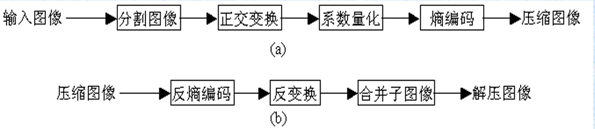
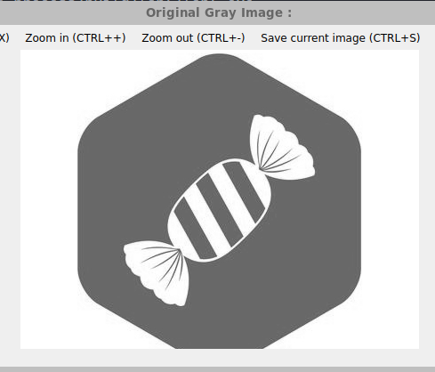
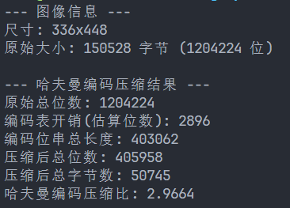

#   **高级图像处理与分析课程实验报告**

 **学号：SA25225261 姓名：吕智 日期：2025.11.11**


# **实验6：图像压缩**

### **一、实验内容**

1. 哈夫曼编码压缩 

​	具体内容：利用$OpenCV $分别对灰度图像行操作，进行哈夫曼编码，计算出压缩比。

2.  $LWZ$编码压缩 

​	具体内容：利用$OpenCV$分别对灰度图像行操作，进行$LWZ$编码，计算 出压缩比。

3. 利用$DCT$或$DFT$在频域进行量化压缩 

​	具体内容：利用$OpenCV$实现灰度图像的$DFT$或$DCT$变换，在频域上进行量化压缩，量化方法为直接丢掉一半影响最小的系数，分割尺寸为$16*16$。

### **二、实验完成情况**

##### 1. 哈夫曼编码压缩

​	哈夫曼编码过程的第一步是，首先对所考虑符号的概率进行排序，创建一系列简化信源，然后将概率最低的符号合并为一个符号，并在下一次信源简化中代替那些概率最低的符号。第二步是，从概率最小的信源开始，直到返回原信源，对每个简化后的信源进行编码。一个两符号信源的最小长度二进制码是0和1。哈夫曼编码过程对一组符号产生最优编码，并且符号概率服从一次只能编码一个符号的限制条件。任何哈夫曼编码串都可以按照从左到右的方式分析串中的每个符号来解码。下面是实现哈夫曼编码的具体流程：

1. 统计字符频率：遍历原始数据，统计每个字符出现的次数，频率是编码长度分配的核心依据。

2. 构建哈夫曼树：以每个字符及其频率为叶子节点，通过反复合并频率最小的两个节点（新节点频率为两节点频率之和），直至形成唯一根节点，构建出带权路径长度最短的二叉树。

3. 生成对应编码：从哈夫曼树根节点出发，规定左分支为 “0”、右分支为 “1”，遍历至每个叶子节点的路径序列，即为该字符的哈夫曼编码。

   代码中哈夫曼树的节点的结构体为：

   ```cpp
   class HuffmanNode{
   public:
       int frequency; //频率
       int gray_value; //灰度值
       std::unique_ptr<HuffmanNode> left;
       std::unique_ptr<HuffmanNode> right;  // 左右子节点
       HuffmanNode(int gray, int freq): gray_value(gray), frequency(freq), left(nullptr), right(nullptr) {}
       ~HuffmanNode() = default;
   };
   ```

   统计图像中字符出现频率代码为：

   ```cpp
   std::map<int,int> collectFrequency(const Mat& pray_image){
       std::map<int, int> frequency;
       const uchar* p = pray_image.ptr<uchar>(0);
       size_t total_pixels = pray_image.total();
       for (size_t i = 0; i < total_pixels; ++i) 
           frequency[static_cast<int>(p[i])]++;
       return frequency;
   }
   ```

   构建哈夫曼树：

   ```cpp
   //构建哈夫曼树
   std::unique_ptr<HuffmanNode> buildHuffmanTree(const std::map<int, int>& frequency){
       std::priority_queue<HuffmanNode*,std::vector<HuffmanNode*>,CompareNode> pq; //优先队列依赖于列表
       //初始化最小堆
       for(auto it=frequency.begin();it != frequency.end();++it){
           pq.push(new HuffmanNode(it->first,it->second));
       }
       //构建哈夫曼树
       while(pq.size() > 1){
           //得到两个最小的节点
           HuffmanNode* _left = pq.top(); 
           pq.pop();
           HuffmanNode* _right = pq.top(); 
           pq.pop();
           int merge_freq = _left->frequency + _right->frequency;
           std::unique_ptr<HuffmanNode> _parent = std::make_unique<HuffmanNode>(-1,merge_freq);
           _parent->left = std::unique_ptr<HuffmanNode>(_left);
           _parent->right = std::unique_ptr<HuffmanNode>(_right);
           pq.push(_parent.release());//将两个最小的节点拼接而成的新节点放入最小堆
       }
       if (pq.empty()) return nullptr;
       HuffmanNode* _root = pq.top(); 
       pq.pop();
       return std::unique_ptr<HuffmanNode>(_root);     //只剩一个节点，此时一定为哈夫曼树的根节点
   }
   ```

   使用递归的方式来生成哈夫曼编码：

   ```cpp
   // 递归生成哈夫曼编码表,c参数为哈夫曼树的根，编码，编码映射
   void generateHuffmanCode(const HuffmanNode* root, std::string code, std::map<int, std::string>& codes){
       if (!root) return;
       if (root->gray_value != -1) {
           codes[root->gray_value] = code;
           return;
       }
       // 遍历左右子树
       generateHuffmanCode(root->left.get(), code + "0", codes); //左子树添0
       generateHuffmanCode(root->right.get(), code + "1", codes); //右子树添1
   }
   ```

##### 2. $LZW$编码压缩

​	$LZW$由$Lemple-Ziv-Welch$ 三人共同创造，用他们的名字命名。它采用了一种先进的串表压缩，将每个第一次出现的串放在一个串表中，用一个数字来表示串，压缩文件只存贮数字，则不存贮串， 从而使图象文件的压缩效率得到较大的提高。$LZW$​算法中，首先建立一个字符串表，把每一个第一次出现的字符串放入串表中，并用一个数字来表示，这个数字与此字符串在串表中的位置有关，并将这个数字存入压缩文件中，如果这个字符串再次出现时，即可用表示它的数字来代替，并将这个数字存入文件中。压缩完成后将串表丢弃。

$LZW$​编码算法的具体执行步骤如下： 

 1. 将词典初始化为包含所有可能的单字符，当前前缀P初始化为空； 

 2.  当前字符$C$的内容为输入字符流中的下一个字符；

 3. 判断$P+C$是否在词典中 

    (1) 如果“是”， 则用$C$扩展$P$，即让$P=P＋C$； 

    (2) 如果“否”，则      ①输出当前前缀$P$的码字到码字流；

     				②将$P＋C$添加到词典中； 

    ​				 ③ 令前缀$P = C $(即现在的$P$仅包含一个字符$C$); 

 4. 判断输入字符流中是否还有码字要编码

     (1) 如果“是”，就返回到步骤2；

     (2) 如果“否” 	① 把当前前缀P的码字输出到码字流; ② 结束。

代码如下：

```cpp
//LZW 编码函数
std::vector<int> lzw_encode_row_global(const cv::Mat& row, std::map<std::string, int>& dictionary, int& next_code){
    if (row.empty()) return {};
    std::vector<int> encoded_output;
    std::string P = "";
    const uchar* row_ptr = row.ptr<uchar>(0);
    for (int j = 0; j < row.cols; ++j) {
        char C = static_cast<char>(row_ptr[j]); // 获取当前像素值
        std::string new_sequence = P + C;
        // 检查字典是否包含 P + C (new_sequence)
        if (dictionary.count(new_sequence)) 
            P = new_sequence;  // P + C 存在，扩展当前序列 P
        else {
            encoded_output.push_back(dictionary[P]); // P + C 不存在，输出 P 的码字
            if(next_code < MAX_CODE)  
                dictionary[new_sequence] = next_code++; //将 P + C 加入字典 (如果字典未满)
            P = std::string(1, C);// 当前序列 P 重置为 C (新的单字符序列)
        }
    }
    if (!P.empty()) 
        encoded_output.push_back(dictionary[P]);
    return encoded_output;
}
```

##### 3. 利用$DCT$或$DFT$​在频域进行量化压缩

​	块变换编码：把图像分成大小相等且不重叠的多个小块，并且二维变换单独处理这些小块。在块变换中，使用一个可逆线性变换把每个小块或子图像映射为一组变换系数，然后对这些系数进行量化和编码。对于大多数图像而言，许多系数的幅度都很小，因此并可被粗糙地量化而几乎不会使图像失真。

​	一个典型的块变换编码系统如图所示，分为四步：子图像分割、 变换、量化和编码。



​	本实验选择采用了DCT变换，因为DCT变换的计算复杂度适中，携带信息量大。DCT的具体公式如下：
$$
r(x,y,\mu,\nu) = s(x,y,\mu,\nu) = \alpha(\mu)\alpha(\nu) \cos\left[\frac{(2x+1)\mu\pi}{2n}\right] \cos\left[\frac{(2y+1)\nu\pi}{2n}\right]
$$

$$
\alpha(\mu) = 
\begin{cases} 
\sqrt{1/n} & \mu = 0 \\
\sqrt{2/n} & \mu = 1,2,\dots,n 
\end{cases}
$$

在代码中，采用直接使用$OpenCV$提供的$dct$和$idct$函数来完成变换操作。

量化编码则采用了阈值编码的方法，对每幅子图像保留最大的N个系数，丢弃最小的N个系数，具体代码如下：

```cpp
//对图像块进行DCT变换、量化压缩和IDCT反变换
void process_block(const Mat& src_image,Mat& dst_image){
    Mat dct_image; 
    dct(src_image, dct_image);  //进行dct变换

    std::vector<float> abs_coeffs;  //收集所有系数的绝对值
    abs_coeffs.reserve(BLOCK_SIZE * BLOCK_SIZE);
    for (int i = 0; i < BLOCK_SIZE; ++i) {
        const float* row_ptr = dct_image.ptr<float>(i);
        for (int j = 0; j < BLOCK_SIZE; ++j)
            abs_coeffs.push_back(std::abs(row_ptr[j]));
    }
    std::sort(abs_coeffs.begin(), abs_coeffs.end(), [](float a, float b) {return a > b;});  //降序排列
    float threshold = abs_coeffs[BLOCK_SIZE*BLOCK_SIZE/2];  // 阈值

    for (int i = 0; i < BLOCK_SIZE; ++i) {
        float* row_ptr = dct_image.ptr<float>(i);
        for (int j = 0; j < BLOCK_SIZE; ++j) {
            if (std::abs(row_ptr[j]) <= threshold && (i!=0 || j!=0)) {
                 row_ptr[j] = 0.0f;
            }
        }
    }
    idct(dct_image, dst_image);   //进行dct反变换
}

void dct_compression(const Mat& src_image, Mat& compressed_image){
    int rows = src_image.rows;
    int cols = src_image.cols;
    compressed_image.create(rows, cols, src_image.type());

    //遍历子图像
    for (int i = 0; i < rows; i += BLOCK_SIZE){
        for (int j = 0; j < cols; j += BLOCK_SIZE) {
            if (i + BLOCK_SIZE > rows || j + BLOCK_SIZE > cols)
                continue; //如果块不满足16*16大小，则跳过
            // 分割子图
            Rect block_rect(j, i, BLOCK_SIZE, BLOCK_SIZE);
            Mat block = src_image(block_rect);
            block.convertTo(block,CV_32FC1);
            subtract(block, Scalar(128.0f), block);

            //正变换,量化编码，反变换
            Mat reconstructed_block;
            process_block(block,reconstructed_block);

            //加回 128.0f 并转换为 CV_8UC1
            add(reconstructed_block, Scalar(128.0f), reconstructed_block);
            reconstructed_block.convertTo(compressed_image(block_rect), CV_8UC1);
        }
    }
}
```

### **三、实验结果**

采用的原始灰度图像为：



##### 1. 哈夫曼编码压缩



哈夫曼编码实现了约 $2.97:1$ 的压缩比。

##### 2. $LWZ$编码压缩


LZW编码实现了约 $5.47:1$ 的压缩比，显著高于哈夫曼编码。这是由于图像中存在大量的重复像素序列（如背景），LZW算法能高效地将这些序列替换为短码字。

##### 3. 利用$DCT$或$DFT$​在频域进行量化压缩 


图像质量基本保持不变，肉眼几乎无法察觉明显的失真或块效应。


