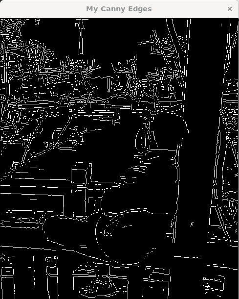
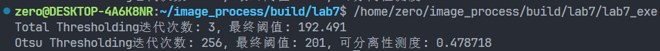

#   **高级图像处理与分析课程实验报告**

 **学号：SA25225261 姓名：吕智 日期：2025.11.13**


# **实验7：图像分割**

### **一、实验内容**

1. $Canny$ 边缘检测 

​	具体内容：利用$OpenCV$对灰度图像行操作，绘制出图像的边缘，并进行$2$值化处理，要求不能使用$OpenCV$自带的$Canny$函数实现。

2.  全局阈值分割  

​	具体内容：利用$OpenCV$对灰度图像行操作，把图像分割为前景和背景， 进行$2$值化处理，要求记录迭代次数和分割阈值。

3. $Otsu$算法分割 

​	具体内容：利用$OpenCV$实现灰度图像的$Otsu$算法分割，把图像分割为前景和背景，进行$2$值化处理，要求记录迭代次数和分割阈值

### **二、实验完成情况**

##### 1. $Canny$ 边缘检测

​	$Canny$ 边缘检测算子，是一种被广泛使用的边缘检测算法。它基于低错误率，边缘点应被很好的定位，单个边缘点响应三个基本目标。

$Canny$算法的过程可以概括为$5$​个步骤：

1）用高斯滤波器进行滤波，消除噪声；

 2）针对每一个像素，计算横向与纵向两方向的微分近似，以得到像素的梯度大小和方向；

 3）对梯度进行"非极大抑制"（非局部最大值置0）； 

4）对梯度取两次阈值； 

5）对边缘进行连接；

前两步可以采用高斯滤波器和Sobel算子来完成，代码为：

```cpp
Mat blurred;
 // 1. 高斯滤波器，消除噪声
GaussianBlur(gray, blurred, Size(5, 5), 1.4); //使用高斯核大小 5x5, sigma=1.4
// 2. 计算横向与纵向两方向的微分
Mat grad_x, grad_y;
Sobel(blurred, grad_x, CV_32F, 1, 0, 3); // Sobel算子计算x方向梯度
Sobel(blurred, grad_y, CV_32F, 0, 1, 3); // Sobel算子计算y方向梯度
Mat magnitude(gray.rows, gray.cols, CV_32F);
Mat angle(gray.rows, gray.cols, CV_32F);
for (int i = 0; i < grad_x.rows; i++) {  
    for (int j = 0; j < grad_x.cols; j++) {  
        float gx = grad_x.at<float>(i, j);  // x方向梯度分量
        float gy = grad_y.at<float>(i, j);  // y方向梯度分量
        magnitude.at<float>(i, j) = sqrt(gx * gx + gy * gy);    // 公式：magnitude = sqrt(gx² + gy²)
        float ang_rad = atan2(gy, gx);  // 弧度制
        float ang_deg = ang_rad * (180.0 / CV_PI);  
        if (ang_deg < 0) 
            ang_deg += 360.0;  
        angle.at<float>(i, j) = ang_deg;    // 角度转换为度数制
    }
}
```

其中第三步，非极大抑制的数学描述是对于图像中每一点 $(x, y)$ 处的梯度幅值 $M(x, y)$ 和梯度方向 $\alpha(x, y)$，执行以下步骤计算非极大值抑制后的幅值 $g_N(x, y)$:

1. 量化方向：寻找最接近梯度方向 $\alpha(x, y)$ 的量化方向 $d_k$。 

2. 邻域比较：定义沿 $d_k$ 方向的两个邻居像素的梯度幅值分别为 $M_1$ 和 $M_2$。

3. 幅值抑制：计算非极大值抑制后的幅值 $g_N(x, y)$：    

   ​						 $$    g_N(x, y) =     \begin{cases}    0 &  M(x, y) < M_1 ， M(x, y) < M_2 \\    M(x, y) & \text{其他}    \end{cases}    $$​

实现非极大抑制的代码如下：

```cpp
// 3. 非极大值抑制
Mat nonMaxSuppressed = Mat::zeros(gray.size(), CV_32F);
for (int i = 1; i < magnitude.rows - 1; i++){
    for(int j = 1; j < gray.cols - 1; ++j){
        float grad_mag = magnitude.at<float>(i, j);
        float grad_angle = angle.at<float>(i, j);
        float neighbor1 = 0.0f, neighbor2 = 0.0f;
        // 将角度量化到 4 个主要方向
        if ((grad_angle >= 0 && grad_angle < 22.5) || 
            (grad_angle >= 157.5 && grad_angle < 202.5) || (grad_angle >= 337.5 && grad_angle <= 360)){  //水平边缘
            neighbor1 = magnitude.at<float>(i, j - 1);
            neighbor2 = magnitude.at<float>(i, j + 1);
        }else if ((grad_angle >= 22.5 && grad_angle < 67.5) ||
                  (grad_angle >= 202.5 && grad_angle < 247.5)){
            neighbor1 = magnitude.at<float>(i - 1, j + 1); // 右上
            neighbor2 = magnitude.at<float>(i + 1, j - 1); // 左下  ]
        }else if ((grad_angle >= 67.5 && grad_angle < 112.5) ||
                  (grad_angle >= 247.5 && grad_angle < 292.5)){ //垂直边缘
            neighbor1 = magnitude.at<float>(i - 1, j);
            neighbor2 = magnitude.at<float>(i + 1, j);
        }else if ((grad_angle >= 112.5 && grad_angle < 157.5) ||
                  (grad_angle >= 292.5 && grad_angle < 337.5)){
            neighbor1 = magnitude.at<float>(i - 1, j - 1); // 左上
            neighbor2 = magnitude.at<float>(i + 1, j + 1); // 右下
        }
        // 非极大值抑制
        if (grad_mag >= neighbor1 && grad_mag >= neighbor2)
            nonMaxSuppressed.at<float>(i, j) = grad_mag;
        else
            nonMaxSuppressed.at<float>(i, j) = 0;
    }
}
```

第四步双阈值处理：利用两个阈值 $t_1$ 和 $t_2$ ($t_2 > t_1$，一般取 $t_2 = 2 \cdot t_1$)，进行以下图像处理： 

1. 生成图像 1 (低阈值，保留较多信息):  将梯度值小于 $t_1$ 的像素的灰度值设为 $0$。 
2. 生成图像 2 (高阈值，噪音较少):    将梯度值小于 $t_2$ 的像素的灰度值设为 $0$​。 由于图像 2 的阈值较高，噪音较少（但也同时损失了有用的边缘信息），而图像 1 的阈值较低，保留了较多信息。因此我们可以以图像2为基础,以图像1为补充来连接图像的边缘。

代码如下：

```cpp
// 4. 双阈值处理
Mat weak_and_strong = Mat::zeros(gray.size(), CV_8U); //图像1
Mat strong_edges = Mat::zeros(gray.size(), CV_8U);    //图像2
for (int i = 0; i < nonMaxSuppressed.rows; i++){
    for(int j = 0; j < nonMaxSuppressed.cols; ++j){
        float pixel_value = nonMaxSuppressed.at<float>(i, j); 
        if (pixel_value >= highThreshold) { // T2
            // 像素同时出现在图像 1 和图像 2
            strong_edges.at<uchar>(i, j) = 255;
            weak_and_strong.at<uchar>(i, j) = 255;
        } else if (pixel_value >= lowThreshold)  // T1
            weak_and_strong.at<uchar>(i, j) = 255;// 像素只出现在图像 1 (弱边缘)
    }
}
```

第五步边缘进行连接：

a. 扫描图像 2，当我们遇到一个非零值的像素 $p$ 时，跟踪以 $p$ 为开始点的轮廓线直到该轮廓线的终点 $q$。

b. 在图像 1 中，考察与图像 2 中 $p$ 点位置对应的点 $p'$ 的 8 邻域。如果 $p'$ 的 8 邻域中有非零像素 $q'$ 存在，将其包括到图像 2 中，作为点 $r$，从 $r$ 开始重复第 a 步，直到我们在图像 1 和图像 2 中都无法继续为止。

c. 我们已经结束了对包含 $p$​ 的轮廓线的连接，将这条轮廓标记为已访问过，回到第 a 步，寻找下一条轮廓线，重复第 (a)(b)(c) 步直到图像 2 中再也找不到新轮廓线为止。

代码如下：

```cpp
//跟踪以p为开始点的轮廓线直到该轮廓线的终点q
Mat iterative_edge_linking(const Mat& weak_and_strong, Mat& strong_edges) {
    queue<Point> q; 
    // 1. 扫描图像 2，将所有非零像素p入队 
    for (int i = 0; i < strong_edges.rows; ++i) {
        for (int j = 0; j < strong_edges.cols; ++j) {
            if (strong_edges.at<uchar>(i, j) == 255) {
                q.push(Point(j, i)); // Point(x, y)
            }
        }
    }
    static const int dx[8] = {-1, -1, -1, 0, 1, 1, 1, 0};
    static const int dy[8] = {-1, 0, 1, 1, 1, 0, -1, -1};
    // BFS 过程：以图像 2 为基础，向外扩展 (对应步骤 a 和 c 的重复)
    while (!q.empty()) {
        Point p = q.front();
        q.pop();
        // 考察 p' 的 8 邻域 
        for (int k = 0; k < 8; ++k) {
            int ni = p.y + dy[k];
            int nj = p.x + dx[k];
            if (ni >= 0 && ni < strong_edges.rows && nj >= 0 && nj < strong_edges.cols) { // 边界检查
                // 检查图像 1 中该邻域是否存在非零像素 q'且该像素尚未被包括到图像 2 中
                if (weak_and_strong.at<uchar>(ni, nj) == 255 && strong_edges.at<uchar>(ni, nj) == 0) {
                    strong_edges.at<uchar>(ni, nj) = 255;  // 将其包括到图像 2中，作为点 r 
                    q.push(Point(nj, ni)); // 从 r 开始重复第 a 步 ,入队继续跟踪轮廓线
                }
            }
        }
    }
    return strong_edges;
}
```

##### 2. 全局阈值分割

​	当目标和背景像素的灰度分布非常不同时，可对整个图像使用单个全局阈值。在大多数应用中，图像之间通常存在足够的变化。它的核心步骤是：

1.  选择一个 $T$ 的初始估计值。

2.  用 $T$ 分割图像，生成两组像素：$G_1$ 由所有灰度值大于 $T$ 的像素组成，而 $G_2$ 由所有灰度值小于或等于 $T$ 的像素组成。

3.  对区域 $G_1$ 和 $G_2$ 中的所有像素计算平均灰度值 $\mu_1$ 和 $\mu_2$。

4.  计算新的阈值 $T$：    $$T = \frac{1}{2}(\mu_1 + \mu_2)$$
    
5.  重复步骤 2 到 4，直到逐次迭代所得的 $T$ 值之差小于事先定义的参数 $T_0$。

实现代码如下：

```cpp
// 全局阈值分割
Mat totalThreshold(const Mat& gray, int& iterations, double& finalThreshold) {
    // 1.选择一个 T 的初始估计值即图像平均灰度
    double T_old = mean(gray)[0]; 
    double T_new = 0;
    iterations = 0; //返回的迭代次数
    const double TO = 0.1; //事先定义的参数T0
    long long sum_G1, count_G1, sum_G2, count_G2; //用于计算平均灰度
    while (true) {
        iterations++; 
        // 2. 用T分割图像，生成两组像素G1和G2
        sum_G1 = 0; count_G1 = 0; // G1: 灰度值 > T 的像素
        sum_G2 = 0; count_G2 = 0; // G2: 灰度值 <= T 的像素
        for (int i = 0; i < gray.rows; ++i) {
            const uchar* p = gray.ptr<uchar>(i);
            for (int j = 0; j < gray.cols; ++j) {
                uchar pixel_value = p[j];
                if (pixel_value > T_old) {
                    sum_G1 += pixel_value; 
                    count_G1++;            
                } else { // 灰度值 <= T_old
                    sum_G2 += pixel_value; 
                    count_G2++;            
                }
            }
        }
        // 3. 计算平均灰度值mu1和 mu2 
        double mu1 = (count_G1 > 0) ? (double)sum_G1 / count_G1 : 0; 
        double mu2 = (count_G2 > 0) ? (double)sum_G2 / count_G2 : 0; 
        // 4. 计算新的阈值 T = 1/2 * (mu1 + mu2)
        T_new = (mu1 + mu2) / 2.0;
        // 5. 重复步骤 2 到 4，直到逐次迭代得到的T值之差小于T0
        if (abs(T_old - T_new) < TO) {
            break;
        }
        T_old = T_new;
        if (iterations > 1000) { 
             cerr << "警告: 迭代次数过多，提前终止。" << endl;
             break; 
        }
    }
    finalThreshold = T_new; // 记录最终分割阈值
    Mat binary_img;
    threshold(gray, binary_img, finalThreshold, 255, THRESH_BINARY); // 应用最终阈值进行二值化
    return binary_img;
}
```

##### 3. $Otsu$算法分割

​	$Ostu$算法在最大化类间方差方面是最优的，因此是在统计判别分析中使用的一种著名测度。这种方法的基本思想是，经过正确阈值处理后的类别相对于它们的像素的灰度值而言应是不同的，而根据灰度值给出类间最优分离的一个阈值会是最好阈值。$Ostu$算法的另一个优点是它完全基于图像的直方图进行计算。具体步骤如下：

1. 计算归一化直方图 $P(k)$: 遍历图像像素，统计每个灰度级 $k$ 的像素计数，然后除以总像素数 $N$ 得到概率分布 $P(k)$。

2. 计算累计和 $P_{1}(k)$:  
   $$
   P_{1}(k) = \sum_{i=0}^{k} P(i)
   $$

3. 计算累积均值 $m(k)$:   
   $$
   m(k) = \sum_{i=0}^{k} i \cdot P(i)
   $$
   

4. 计算全局灰度均值 $m_G$:  全局均值等于累积均值的最大值（即 $k=255$ 时） $$m_G = m(255)$$

5. 计算类间方差 $\sigma_B^2(k)$:
   $$
   \sigma_B^2(k) = \frac{(m_G P_{1}(k) - m(k))^2}{P_{1}(k) \cdot (1-P_{1}(k))}
   $$

6. 得到 Otsu 阈值 $k^*$:  $k^*$ 即为 $\sigma_B^2(k)$ 最大时的 $k$ 值。如果极大值不唯一，则取对应各个极大值的 $k$ 值的平均值来得到 $k^*$。

7. 计算可分离性测度 $\eta$:  利用$k=k^*$计算$\eta$
   $$
   \eta = \frac{\sigma_B^2(k^*)}{\sigma_G^2}
   $$

实现代码为：

```cpp
// 归一化直方图
vector<float> NormalizedHistogram(const Mat& gray, int N){
    const int histSize = 256;
    vector<int> hist(histSize, 0);
    for (int i = 0; i < gray.rows; ++i) {
        const uchar* p = gray.ptr<uchar>(i);
        for (int j = 0; j < gray.cols; ++j) {
            uchar pixel_value = p[j];
            hist[pixel_value]++; 
        }
    }
    vector<float> P_k_vector(histSize);
    for (int k = 0; k < histSize; ++k) 
        P_k_vector[k] = (float)hist[k] / N;
    return P_k_vector;
}
//Ostu算法分割
Mat OtsuThreshold(const Mat& gray, int& iterations, double& finalThreshold, double& separabilityMeasure) {
    // 1. 计算归一化直方图 P(k)
    int N = gray.rows * gray.cols;
    int histSize = 256;
    vector<float> P_k = NormalizedHistogram(gray, N);  
    // 准备数组存储累积值
    float P1[256] = {0}; // P_1(k)
    float m_k[256] = {0}; // m(k)
    // 预计算 P_1(k) 和 m(k)
    float P_sum = 0;
    float m_sum = 0;
    for (int k = 0; k < 256; ++k) {
        // 2. 计算累计和 P_1(k)
        P_sum += P_k[k];
        P1[k] = P_sum;
        // 3. 计算累积均值 m(k)
        m_sum += k * P_k[k];
        m_k[k] = m_sum;
    }
    // 4. 计算全局灰度均值 mG
    float mG = m_k[histSize - 1];
    // 寻找最佳阈值 k*
    float max_sigma_b_squared = -1.0f;
    vector<int> best_k_values; // 存储所有最大值对应的 k
    iterations = 0; // 记录遍历次数
    for (int k = 0; k < 256; ++k) {
        iterations++; 
        float P_C1 = P1[k];          // 前景概率 P_1(k)
        float P_C2 = 1.0f - P_C1;    // 背景概率 P_2(k)
        if (P_C1 < 1e-6 || P_C2 < 1e-6) continue; // 避免除以零和边界条件
        // 5. 计算类间方差 sigma^2_B(k)
        float numerator = pow(mG * P_C1 - m_k[k], 2);
        float denominator = P_C1 * P_C2;
        float sigma_b_squared = numerator / denominator; // (mG * P_C1 - m_k)^2 / (P_C1 * P_C2)
        // 6. 得到 Otsu 阈值 k_star
        if (sigma_b_squared > max_sigma_b_squared) {
            max_sigma_b_squared = sigma_b_squared;
            best_k_values.clear();
            best_k_values.push_back(k);
        } else if (sigma_b_squared == max_sigma_b_squared) {
             best_k_values.push_back(k); // 极大值不唯一
        }
    }
    // 极大值不唯一时，取平均值
    if (!best_k_values.empty()) {
        int sum_k = 0;
        for(int k : best_k_values) sum_k += k;
        finalThreshold = (double)sum_k / best_k_values.size(); 
    } else {
        finalThreshold = 0; // 默认值
    }
    // 7. 计算全局方差 sigma_G^2，然后计算可分离性测度 (Eta)
    float sigma_G_squared = 0;
    for (int k = 0; k < 256; ++k) 
        sigma_G_squared += pow(k - mG, 2) * P_k[k];
    if (sigma_G_squared > 1e-6) {
        separabilityMeasure = max_sigma_b_squared / sigma_G_squared; //可分离性测度 η = sigma^2_B(k*) / sigma^2_G
    } else {
        separabilityMeasure = 0;
    }
    Mat binary_img;
    threshold(gray, binary_img, finalThreshold, 255, THRESH_BINARY); // 二值化处理
    return binary_img;
}
```

### **三、实验结果**

##### 1. $Canny$ 边缘检测

原始的灰度图像为：


采用$Canny$算法分割，双阈值分别为$40，80$时的处理结果为：



从上面的图像可以看到，$Canny$算法效果展示了清晰、连贯的图像边缘，成功地将前景与背景环境进行了轮廓分离。

##### 2. 全局阈值分割

由于采用上图来完成全局阈值分割和$Ostu$算法分割的效果不明显，这里截取了书上的聚合细胞光学显微镜图像，原图为：


采用全局阈值分割的结果为：


从结果图看，该算法可以将部分前景和背景分离，结果图将灰度图中主要的圆形目标结构细胞从背景中剥离出来，但实现效果不佳。

##### 3. $Otsu$算法分割

采用$Otsu$算法分割的结果：


从上图可以看出，采用$Ostu$算法的效果要明显优于全局阈值分割，这是由于原始灰度图像并没有明显的波谷，并且背景与目标之间的灰度差很小，全局阈值并不能达到很好的效果。

以上两种算法都是通过迭代的方式实现的，他们的迭代结果如下：



两种算法找到了接近但不同的阈值，$Otsu$算法找到的阈值更高，这意味着它将更多的中等灰度像素归入了背景，使分割后的前景主体略微收缩，边缘更清晰。

